# Viditelnost, interpolace, mapová algebra

Ve cvičení se naučíte
{: align=center style="font-size: 1.25rem; font-weight: bold; margin-bottom: 10px;"}

<style>
    .smaller_padding li {padding:.4rem .8rem !important;}
    .primary_color {color:var(--md-primary-fg-color);}
</style>

<div class="grid cards smaller_padding" markdown>

-   :material-chart-bell-curve-cumulative:{ .xxxl .middle }
    {.middle style="display:table-cell;min-width:40px;padding-right:.8rem;"}

    __interpolovat__ výškový povrch z bodů různými metodami a __porovnat jejich přesnost__
    {.middle style="display:table-cell;line-height:normal;"}

-   :material-eye-outline:{ .xxxl .middle }
    {.middle style="display:table-cell;min-width:40px;padding-right:.8rem;"}

    určit, __co je vidět__ z vybraného místa v krajině
    {.middle style="display:table-cell;line-height:normal;"}

-   :material-calculator-variant-outline:{ .xxxl .middle }
    {.middle style="display:table-cell;min-width:40px;padding-right:.8rem;"}

    použít __mapovou algebru__ k výpočtu relativního výškového modelu řeky
    {.middle style="display:table-cell;line-height:normal;"}

</div>

## Náplň cvičení

Cvičení má tři části, které pracují nad __stejným územím a stejným DMR__. Nejdříve si z dat DMR 5G připravíme výškovou mozaiku. Na ní ověříme, jak přesně jednotlivé interpolační metody dokážou povrch zrekonstruovat z řídkých bodů, spočítáme viditelnost z vybraného místa a nakonec pomocí rastrové kalkulačky vytvoříme relativní výškový model řeky (REM).

## Základní pojmy

- **Interpolace** – odhad neznámé hodnoty jevu v daném místě na základě známých okolních hodnot
- **Extrapolace** – dopočet hodnot za hranicí oblasti pokryté vstupními body
- **Linie viditelnosti (line of sight)** – profil mezi pozorovatelem a cílem s vyznačením viditelných a zakrytých úseků
- **Rastrová kalkulačka** – nástroj spouštějící výrazy mapové algebry
- **DMT (digitální model terénu)** – digitální reprezentace terénu (obecný pojem zahrnující různé způsoby vyjádření terénního reliéfu nebo povrchu)
- **DMR (digitální model reliéfu)** – digitální reprezentace zemského povrchu (NEobsahuje vegetaci ani lidské stavby)
- **DMP (digitální model povrchu)** – digitální reprezentace zemského povrchu (obsahuje vegetaci a lidské stavby pevně spojené s reliéfem)
- **REM (relativní výškový model)** – DMR vztažený k vodní hladině toku

## Interpolace

Z vrstvy _DMR_ si „nasimulujeme“ řídké výškové měření v náhodných bodech, z těchto bodů zpětně interpolujeme povrch a výsledek porovnáme s původním DMR. Díky tomu známe „pravdu“ a chybu každé metody můžeme přímo spočítat.

### Interpolační metody

<div class="grid cards" markdown>

-   :material-chart-scatter-plot:{ .lg .middle } __IDW__ (Inverse Distance Weighted)

    <hr class="regular_margin">

    Hodnota buňky je vážený průměr okolních bodů, váha klesá s mocninou vzdálenosti (parametr _Power_). Nevytváří hodnoty mimo rozsah vstupních dat, a proto nezachytí vrcholy a dna údolí, pokud v nich neleží bod. Kolem bodů vznikají typické „bubliny“.

    [<span>pro.arcgis.com</span><br>How IDW works](https://pro.arcgis.com/en/pro-app/latest/tool-reference/3d-analyst/how-idw-works.htm){ .md-button .md-button--primary .server_name .external_link_icon_small target="_blank"}
    {: .button_array}

-   :material-vector-curve:{ .lg .middle } __Spline__

    <hr class="regular_margin">

    Prokládá body plochou s minimální křivostí. Výsledek je hladký a může přesáhnout rozsah vstupních hodnot. Typ _Regularized_ tvoří elastičtější povrch, _Tension_ plošší. Nehodí se tam, kde blízké body mají velmi rozdílné hodnoty.

    [<span>pro.arcgis.com</span><br>How Spline works](https://pro.arcgis.com/en/pro-app/latest/tool-reference/3d-analyst/how-spline-works.htm){ .md-button .md-button--primary .server_name .external_link_icon_small target="_blank"}
    {: .button_array}

-   :material-hexagon-multiple-outline:{ .lg .middle } __Natural Neighbor__

    <hr class="regular_margin">

    Váhy odvozuje z překryvu Thiessenových (Voronoiových) polygonů. Používá jen nejbližší body, je lokální a nemá téměř žádné parametry.

    [<span>pro.arcgis.com</span><br>How Natural Neighbor works](https://pro.arcgis.com/en/pro-app/latest/tool-reference/3d-analyst/how-natural-neighbor-works.htm){ .md-button .md-button--primary .server_name .external_link_icon_small target="_blank"}
    {: .button_array}

-   :material-chart-bell-curve:{ .lg .middle } __Kriging__

    <hr class="regular_margin">

    Geostatistická metoda. Váhy závisí na vzdálenosti i na prostorové autokorelaci dat popsané semivariogramem. Pro většinu dat volíme _Ordinary Kriging_.

    [<span>pro.arcgis.com</span><br>How Kriging works](https://pro.arcgis.com/en/pro-app/latest/tool-reference/3d-analyst/how-kriging-works.htm){ .md-button .md-button--primary .server_name .external_link_icon_small target="_blank"}
    {: .button_array}

</div>

## Mapová algebra – relativní výškový model (REM)

<figure markdown>
  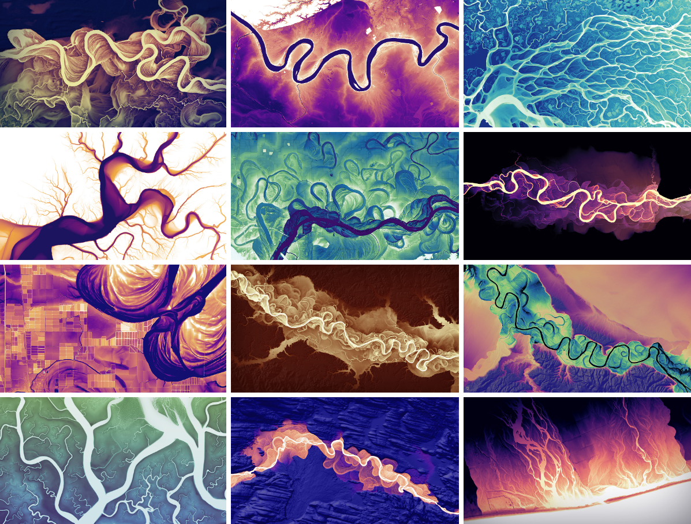
  <figcaption>Relativní výškový model</figcaption>
</figure>

Relativní výškové modely pomáhají lépe porozumět terénu v okolí toku. Z výšek hladiny řeky interpolujeme plochu, která vystihuje spád údolí (tzv. detrendovaný povrch), a odečteme ji od DMR. Zůstanou tak jen výšky terénu vůči hladině. REM je užitečný pro vizualizaci říčních tvarů, které jsou z leteckých snímků či samotného DMR obtížně rozeznatelné. Jejich identifikace má velkou vypovídací hodnotu při studiu migrace koryt a povodní, při stavebních pracích i při studiu výskytu živočichů.

Z REM můžeme identifikovat:

- stržovou erozi,
- meandry s přiléhajícími hřbety a koryty ve tvaru půlměsíce,
- slepá ramena,
- izolované povodně,
- hráze.

<figure markdown>
  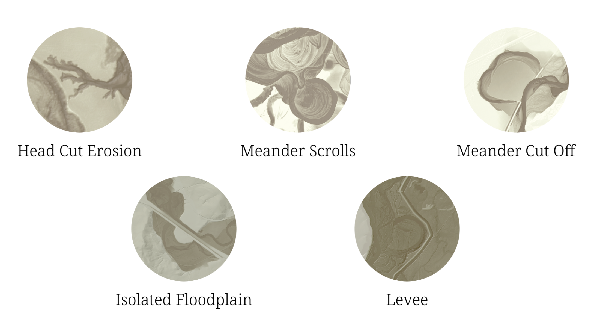{ width="600" }
  <figcaption>Říční tvary</figcaption>
</figure>

[REM Story mapa](https://storymaps.arcgis.com/stories/19b6bfe0c3aa454c853bd6d9b7228adf){ .md-button .md-button--primary .button_smaller .external_link_icon target="_blank"}
{: .button_array}

## Použité datové podklady

- [DMR 5G](../../data/#dmr-5g)
- [ArcČR 500](../../data/#arccr-500) verze 3.3 (úlohy k procvičení)

<hr class="level-1">

## Příprava dat

!!! note-grey "Poznámka"

    Území volíme s ohledem na poslední část (REM). Vhodná je oblast, kde má řeka možnost měnit svůj tvar v čase – rovinaté území s meandry, slepými rameny či záplavami. Řeka protékající úzkým údolím nemá pro změny toku prostor a relativní výškový model zde nemá pro analýzy smysl. Zároveň je dobré, aby v území nebo na jeho okraji byl výrazný vrchol (kopec, rozhledna) pro analýzu viditelnosti.

**1.** __Stažení dat__

Z Geoportálu ČÚZK si stáhneme dlaždice DMR 5G pokrývající část vybrané řeky. Zazipované soubory `*.laz` rozbalíme a připojíme do ArcGIS Pro.

<figure markdown>
  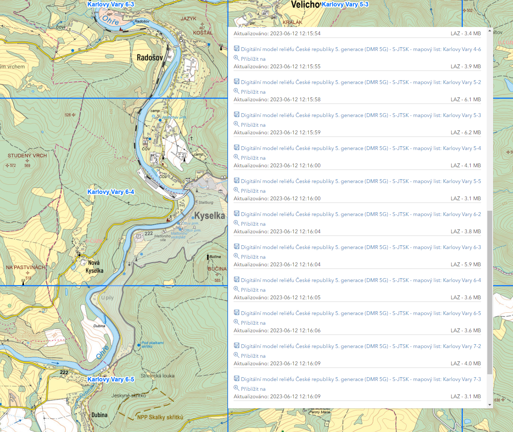{ width="600" }

  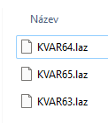{ width="100"}
  <figcaption>Stažení dat z Geoportálu ČÚZK</figcaption>
</figure>

**2.** __Založení projektu v ArcGIS Pro__

Po založení projektu nastavíme souřadnicový systém mapy na _S-JTSK Krovak EastNorth_ (EPSG:5514).

**3.** __Konverze LAZ souborů__

Soubory převedeme do formátu LAS funkcí _CONVERT LAS_.

<figure markdown>
  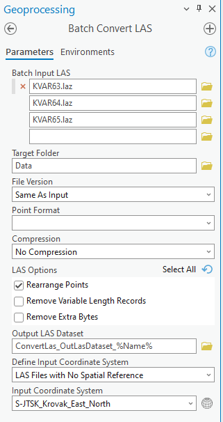{ width="300" }
  <figcaption>Převod *.laz souborů na *.las</figcaption>
</figure>

!!! note-grey "Poznámka"

    - Funkci můžeme spustit pro každý soubor zvlášť nebo dávkově (viz cv. 1: [Batch Processing](../cviceni1/#batch-geoprocessing)).
    - Po aktualizaci připojené složky se nám v záložce _Catalog_ zobrazí konvertované LAS soubory mračna bodů.

**4.** __Tvorba DMR__

!!! note-grey "Poznámka"

    - Postup je vysvětlen ve cv. 3: [Vytvoření digitálního modelu terénu](../cviceni3/#vytvoreni-digitalniho-modelu-terenu).
    - Velikost buňky volíme s ohledem na přesnost dat, pro DMR 5G nastavíme 2 m.

**5.** __Tvorba rastrové mozaiky__

Ze vzniklých dlaždic vytvoříme jediný výškový rastr funkcí _MOSAIC TO NEW RASTER_. Tuto mozaiku (dále vrstva _DMR_) použijeme ve všech třech částech cvičení.

<figure markdown>
  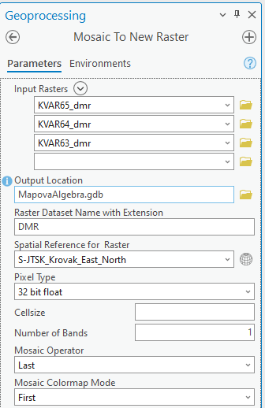{ width="300" }
  <figcaption>Rastrová mozaika</figcaption>
</figure>

## Interpolace

**6.** __Náhodné body__

Funkcí _CREATE RANDOM POINTS_ vytvoříme v rozsahu vrstvy _DMR_ (parametr _Constraining Extent_) 300–500 bodů. Nastavíme i minimální vzdálenost mezi body (např. 20 m), aby se body neshlukovaly.

<!-- TODO: screenshot ../assets/cviceni10/random-points.png -->

**7.** __Přiřazení výšky bodům__

Funkcí _EXTRACT VALUES TO POINTS_ přiřadíme bodům hodnotu vrstvy _DMR_ (stejnou funkci použijeme i v části REM).

**8.** __Interpolace různými metodami__

Z bodů vytvoříme výškové rastry funkcemi _IDW_, _SPLINE_, _NATURAL NEIGHBOR_ a _KRIGING_ (sada _Spatial Analyst_ i _3D Analyst_ → _Interpolation_).

<div class="table_small_padding" markdown>
| Funkce | Typ metody | Klíčové parametry |
|---|---|---|
| _IDW_ | deterministická, lokální | _Power_ (výchozí 2), počet bodů |
| _SPLINE_ | deterministická, lokální | _Regularized_ / _Tension_, _Weight_ |
| _NATURAL NEIGHBOR_ | deterministická, lokální | – |
| _KRIGING_ | geostatistická | _Ordinary_ / _Universal_, model semivariogramu |
</div>

!!! note-grey "Poznámka"

    - Ve všech funkcích nastavíme velikost výstupní buňky na 2 m.
    - V záložce _Environments_ nastavíme _Processing Extent_ a _Snap Raster_ na vrstvu _DMR_. Rastry pak budou mít stejný rozsah i mřížku a můžeme je přímo odečítat v rastrové kalkulačce.
    - U IDW vyzkoušíme i jinou hodnotu _Power_ (např. 1 a 4) a sledujeme, jak se mění „bubliny“ kolem bodů.

<!-- TODO: screenshot ../assets/cviceni10/interpolace-porovnani.png -->

**9.** __Porovnání s DMR__

Pro každou metodu spočítáme v _RASTER CALCULATOR_ rozdílový rastr:

```
"IDW_2m" - "DMR"
```

Rozdílové rastry zobrazíme divergentní barevnou stupnicí se středem v nule. Statistiky (minimum, maximum, průměr, směrodatnou odchylku) najdeme v _Properties_ → _Source_ → _Statistics_ nebo je zjistíme funkcí _GET RASTER PROPERTIES_.

???+ note-grey "Otázky k zamyšlení"

    - Která metoda má nejmenší směrodatnou odchylku rozdílu?
    - Kde se chyby koncentrují (svahy, hrany údolí, okraje území)?
    - Proč Spline může vytvořit hodnoty mimo rozsah vstupních bodů, zatímco IDW a Natural Neighbor ne?

## Viditelnost

**10.** __Pozorovací bod__

Založíme novou bodovou třídu prvků (vrstva _Pozorovatel_) a umístíme do ní pozorovací bod – vrchol kopce, rozhlednu, věž kostela apod. Do atributové tabulky přidáme pole `OFFSETA` (typ _Double_) s výškou pozorovatele nad terénem, např. `1.7` pro člověka nebo výšku vyhlídkové plošiny rozhledny.

!!! note-grey "Poznámka"

    Funkce _VIEWSHED_ a _OBSERVER POINTS_ čtou parametry pozorovatele pouze z polí s pevnými názvy (`OFFSETA`, `OFFSETB`, `RADIUS2`, `AZIMUTH1` …). Pokud pole `OFFSETA` chybí, použije se výchozí výška 1 m.

    [<span>doc.esri.com</span><br>Using Viewshed and Observer Points](https://doc.esri.com/en/arcgis-pro/latest/tool-reference/spatial-analyst/using-viewshed-and-observer-points-for-visibility.html){ .md-button .md-button--primary .server_name .external_link_icon_small target="_blank"}
    {: .button_array}

**11.** __Výpočet viditelnosti__

Spustíme funkci _VIEWSHED_ (_Spatial Analyst_ → _Surface_) se vstupním rastrem _DMR_ a vrstvou _Pozorovatel_. Hodnota buňky ve výsledku udává, z kolika pozorovacích bodů je buňka vidět – při jednom bodě tedy 0 = neviditelné, 1 = viditelné.

<!-- TODO: screenshot ../assets/cviceni10/viewshed.png -->

!!! note-grey "Poznámka"

    - Výsledek zobrazíme poloprůhledně přes stínovaný reliéf (funkce _HILLSHADE_), aby bylo patrné, které svahy jsou vidět.
    - Dohled můžeme omezit vzdáleností (pole `RADIUS2`) nebo výsečí (pole `AZIMUTH1` a `AZIMUTH2`). Funkce _GEODESIC VIEWSHED_ tyto parametry nabízí přímo v dialogu.
    - DMR neobsahuje vegetaci ani stavby, výsledek je proto „teoretická“ viditelnost holého terénu. Pro realističtější výsledek bychom použili DMP (DMP 1G).

**12.** __Více pozorovatelů__

Přidáme do vrstvy _Pozorovatel_ 2–3 další body a spustíme funkci _OBSERVER POINTS_. Ve výsledné atributové tabulce jsou pole `OBS1`, `OBS2` …, podle kterých zjistíme, __který__ pozorovatel dané místo vidí.

**13.** __Linie viditelnosti__

Funkcí _CONSTRUCT SIGHT LINES_ (_3D Analyst_) vytvoříme spojnice mezi pozorovatelem a několika cílovými body a funkcí _LINE OF SIGHT_ vyhodnotíme, které úseky jsou viditelné (zeleně) a které zakryté (červeně).

## Mapová algebra – relativní výškový model (REM)

**14.** __Odečtení extrémních hodnot__

Nástrojem _Explore_ na záložce _Map_ zjistíme minimální a maximální nadmořskou výšku toku.

<figure markdown>
  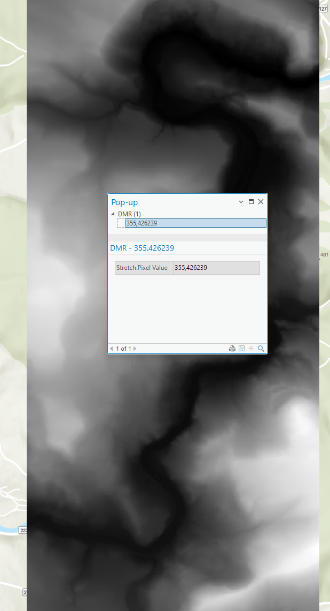
  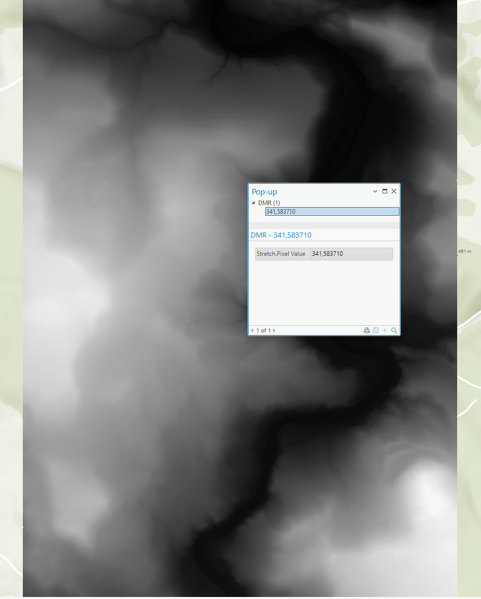
  {: .process_container}

  <figcaption>Odečtení maximální a minimální nadmořské výšky řeky z mozaiky</figcaption>
</figure>

**15.** __Změna symbologie DMR__

Vrstvě _DMR_ nastavíme vlastní symbologii podle zjištěných extrémních hodnot.

<figure markdown>
  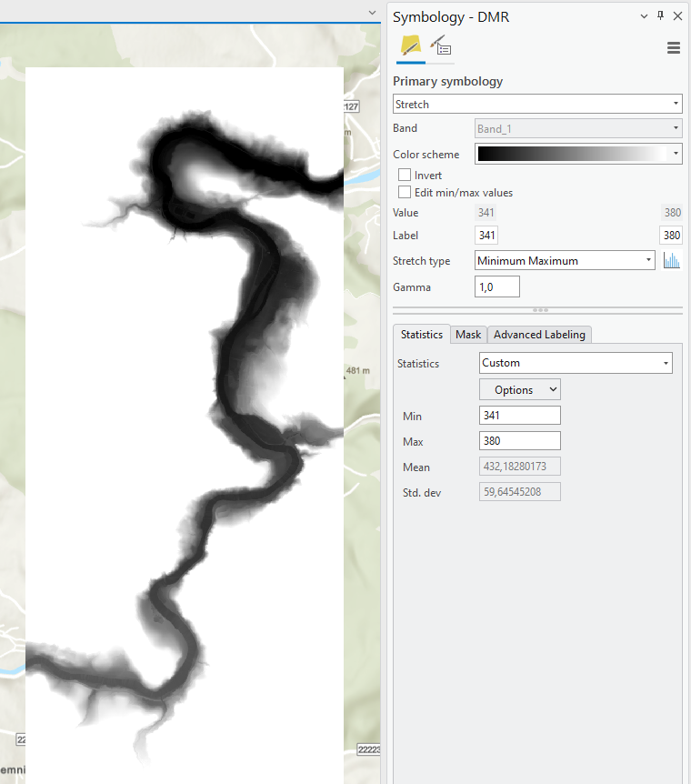{ width="500" }
  <figcaption>Úprava symbologie DMR</figcaption>
</figure>

!!! note-grey "Poznámka"

    Extrémní hodnoty můžeme přizpůsobit tak, aby byla dobře vidět kostra řeky i s přítoky.

**16.** __Středová čára řeky__

Abychom mohli vypočítat výškový model vztažený k hladině řeky, potřebujeme bodovou vrstvu s nadmořskými výškami hladiny. Založíme novou třídu prvků (vrstva _Osa_reky_) a nakreslíme středovou čáru řeky, podle které následně vygenerujeme body.

<figure markdown>
  
  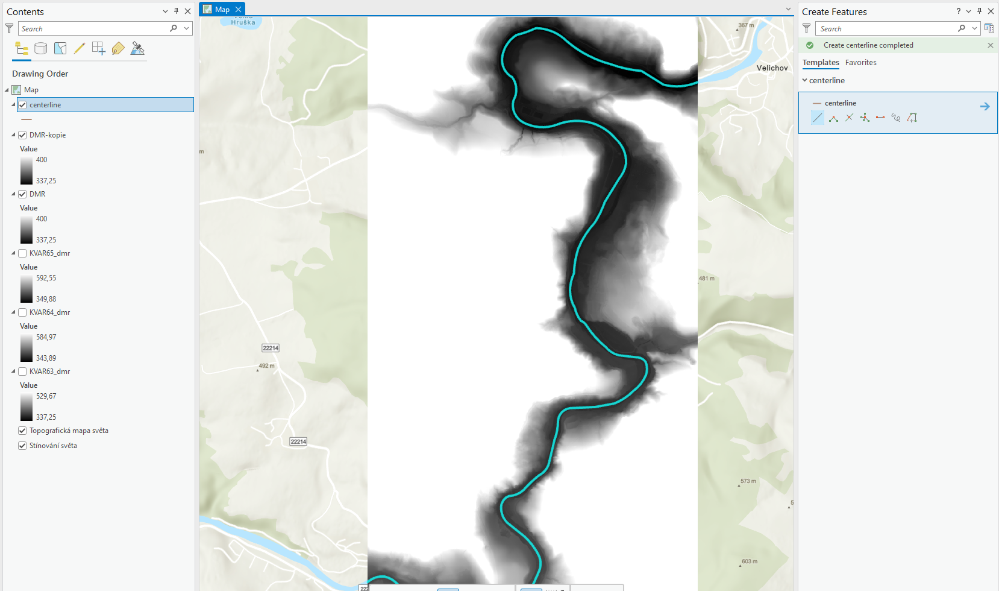
  {: .process_container}

  <figcaption>Tvorba středové čáry řeky</figcaption>
</figure>

**17.** __Body podél středové čáry__

Body vytvoříme funkcí _GENERATE POINTS ALONG LINES_. Vzdálenost mezi nimi nastavíme přibližně na šířku řeky.

!!! note-grey "Poznámka"

    Šířku řeky zjistíme nástrojem _Measure_ na záložce _Map_.

    <figure markdown>
      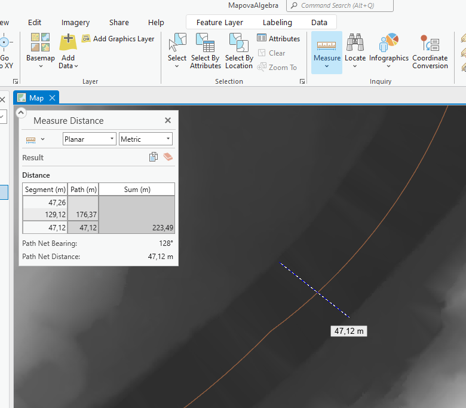{ width="500" }
      <figcaption>Nástroj měření</figcaption>
    </figure>

**18.** __Informace o nadmořské výšce__

Funkcí _EXTRACT VALUES TO POINTS_ přiřadíme bodům hodnotu pixelu vrstvy _DMR_, na jehož místě bod leží.

<figure markdown>
  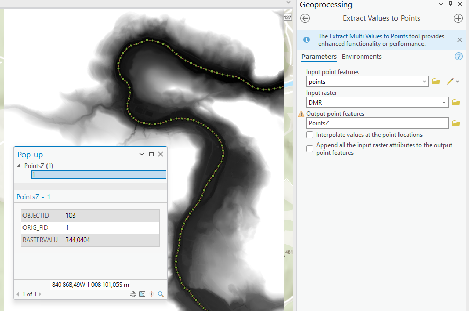{ width="600" }
  <figcaption>Přiřazení výšky bodům</figcaption>
</figure>

**19.** __Interpolace hladiny__

Z výškových bodů vytvoříme funkcí _IDW_ rastr hladiny řeky (vrstva _IDW_hladina_).

<figure markdown>
  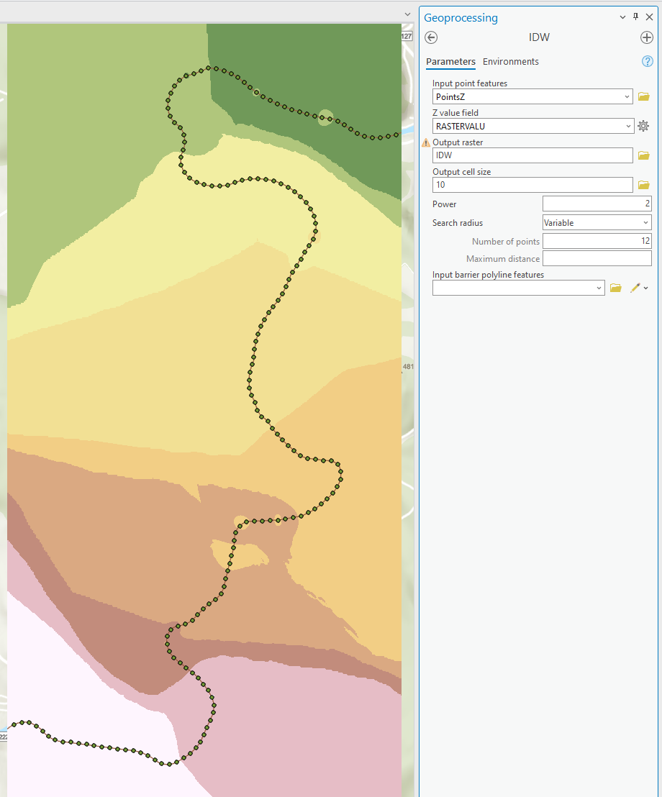
  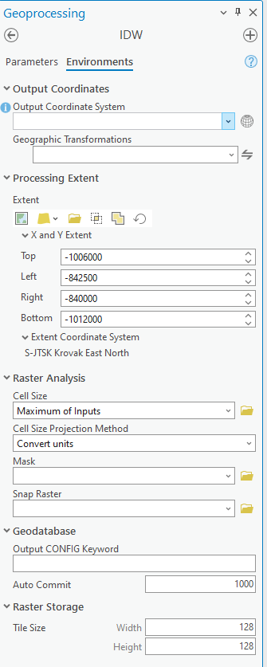
  {: .process_container}

  <figcaption>Interpolace</figcaption>
</figure>

!!! note-grey "Poznámka"

    Výchozí rozsah interpolace odpovídá rozsahu vstupní vrstvy, tj. bodům na řece. My ale chceme interpolovat na celý rozsah vrstvy _DMR_, proto v záložce _Environments_ nastavíme _Processing Extent_ na _DMR_. Když zároveň nastavíme _Cell Size_ a _Snap Raster_ na _DMR_, můžeme následující krok vynechat.

**20.** __Převzorkování__

Pokud jsme v předchozím kroku nenastavili _Cell Size_ a _Snap Raster_, převzorkujeme interpolovaný rastr funkcí _RESAMPLE_ tak, aby velikost i poloha pixelu odpovídaly vrstvě _DMR_. Shodná mřížka je pro práci s rastrovou kalkulačkou nutná.

<figure markdown>
  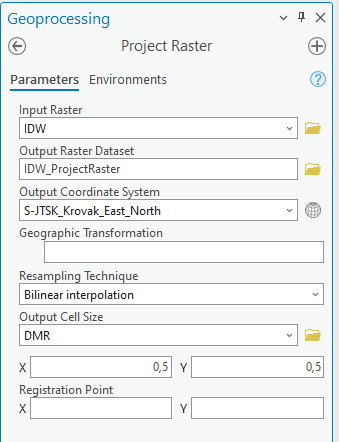
  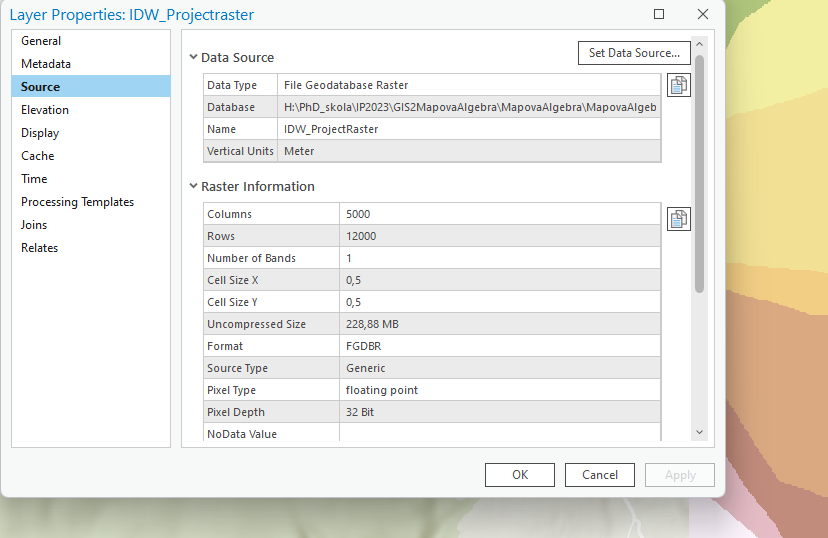
  {: .process_container}

  <figcaption>Převzorkování rastru a kontrola velikosti pixelu</figcaption>
</figure>

**21.** __Výpočet REM__

REM vypočteme funkcí _RASTER CALCULATOR_ odečtením interpolované hladiny od DMR:

```
"DMR" - "IDW_hladina"
```

Kladné hodnoty odpovídají výšce terénu nad hladinou řeky.

<figure markdown>
  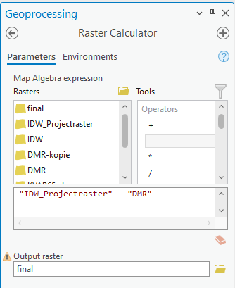{ width="300" }
  <figcaption>Rastrová kalkulačka</figcaption>
</figure>

**22.** __Symbologie výsledného REM__

Výsledný REM zobrazíme metodou _Stretch_ se spojitou barevnou stupnicí. Horní mez nastavíme nízko (např. 5–10 m), aby vynikly tvary v nivě.

<figure markdown>
  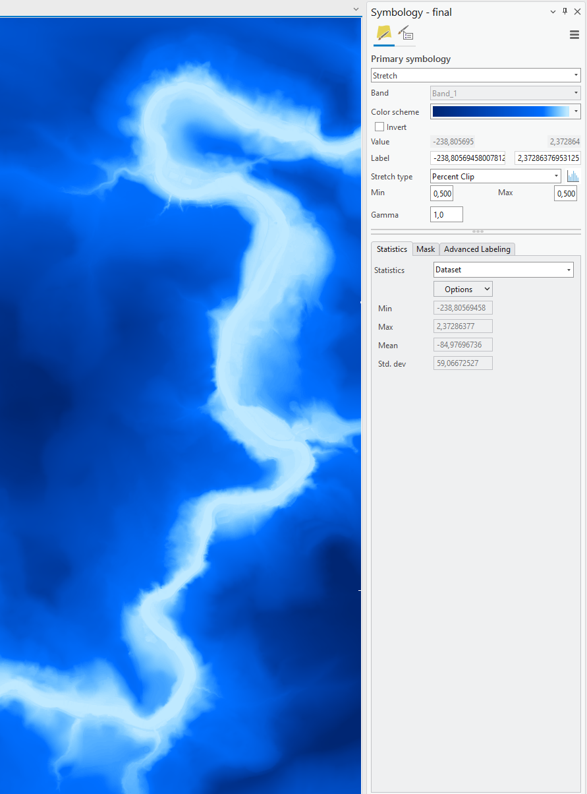{ width="500" }
  <figcaption>Vizualizace výsledku</figcaption>
</figure>

<hr class="level-1">

## Zdroje

Relative Elevation Models [online]. MONTANA STATE LIBRARY [cit. 2024-01-25]. Dostupné z: [https://storymaps.arcgis.com/stories/19b6bfe0c3aa454c853bd6d9b7228adf](https://storymaps.arcgis.com/stories/19b6bfe0c3aa454c853bd6d9b7228adf)

Relative Elevation Model in ArcGIS Pro [online]. esri video [cit. 2024-01-25]. Dostupné z: [https://mediaspace.esri.com/media/t/1_pn5ltf54](https://mediaspace.esri.com/media/t/1_pn5ltf54)

Using Viewshed and Observer Points for visibility analysis [online]. Esri [cit. 2026-09-29]. Dostupné z: [https://doc.esri.com/en/arcgis-pro/latest/tool-reference/spatial-analyst/using-viewshed-and-observer-points-for-visibility.html](https://doc.esri.com/en/arcgis-pro/latest/tool-reference/spatial-analyst/using-viewshed-and-observer-points-for-visibility.html)

## Úlohy k procvičení

!!! task-fg-color "Úlohy"

    K řešení následujících úloh použijte datovou sadu [ArcČR
    500](../../data/#arccr-500) verzi 3.3 dostupnou na disku *S* ve složce
    ``K155\Public\data\GIS\ArcCR500 3.3``. Data meteorologických stanic
    (úlohy 9 a 10) jsou ke stažení jako
    [zip archiv](https://geo.fsv.cvut.cz/vyuka/155gis2/geodata/gis2-cviceni05.zip).

    **Mapová algebra**

    1. Jaká je plocha území v ha s nadmořskou výškou mezi 500 a 700 m?

    2. Jaká je výměra území v ha, pro které platí, že leží v nadmořské
       výšce nad 700 m a má sklon svahu větší než 25 gonů?

    3. Jaký průměrný sklon mají svahy, které jsou vzdáleny do 10 km od
       státní hranice? Jak velký je rozdíl oproti průměrné hodnotě
       počítané pro celé území státu?

    4. Jaká je plocha území v ha, kde se sklon limitně blíží k nule?

    5. Vytvořte pomocí Raster Calculatoru rastr, který obsahuje hodnotu 1
       pro území, kde je nadmořská výška nad 700 m a sklon menší než 5°,
       a hodnotu 2, kde je nadmořská výška nad 700 m a sklon větší než 5°.
       Jaká je výměra takto určeného území v ha?

    **Viditelnost**

    6. Jaká je plocha území v km², která je viditelná z výškové kóty
       Varhošť (ID 725), pokud stojí pozorovatel 1,7 m nad terénem?

    7. Je z výškové kóty Varhošť (ID 725) vidět na výškovou kótu Sklářský
       vrch (ID 476)? Pokud ne, v jaké vzdálenosti od pozorovatele leží
       první překážka?

    **Interpolace**

    8. Z výškových kót (VyskoveKoty) vytvořte metodami IDW a Spline rastr
       nadmořských výšek se stejným prostorovým rozlišením, jaké má výškový
       model ArcČR 500. Oba rastry odečtěte od výškového modelu ArcČR 500
       a porovnejte směrodatné odchylky rozdílů. Která metoda dává
       přesnější výsledek?

    9. Na základě naměřené teploty odvoďte rastr metodou IDW (výchozí
       hodnoty). Jaká je průměrná teplota na území ČR?

    10. Jaká je průměrná teplota v nadmořské výšce větší než 700 m při
        použití rastru vypočteného metodou Kriging (výchozí hodnoty)?
