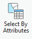
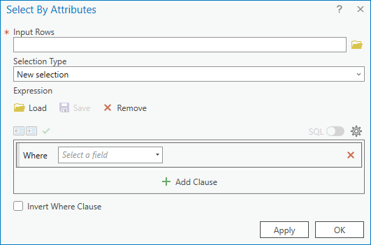
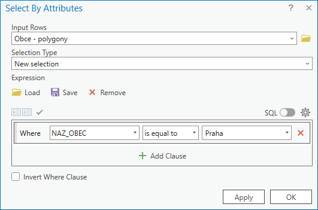
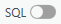
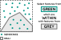

---
icon: material/numeric-2-box
title: Cvičení 2
---

# Souřadnicové systémy, atributové a prostorové dotazy

## Cíle cvičení

-   :material-axis-arrow:{ .xl }

    vysvětlit, proč má každá vrstva **souřadnicový referenční systém (CRS)**

-   :material-map-marker-radius:{ .xl }

    rozpoznat běžné souřadnicové systémy používané v Česku a ověřit je v ArcGIS Pro

-   :material-filter-variant:{ .xl }

    provádět **atributové dotazy** nad popisem objektů

-   :material-select-drag:{ .xl }

    provádět **prostorové výběry** podle vztahu mezi vrstvami

-   :material-water-outline:{ .xl }

    pracovat s daty o vodních tocích, povodích a zastavěném území jako s podklady pro rozhodování v území

## Datové podklady

- datové úložiště Shares, složka ``\K155\Public\155GISZ\cvic02``
- [:material-download: DATA :material-layers:](../assets/cviceni2/cv02_data.zip){ .md-button .md-button--primary .button_smaller } 

## Proč nestačí, že vrstva „je na správném místě“

Každý prostorový prvek má geometrii uloženou jako souřadnice. Aby GIS věděl, **co čísla znamenají a kde je má zobrazit**, potřebuje znát souřadnicový referenční systém (**CRS**, dříve také SRS). CRS určuje zejména vztažný systém, způsob zobrazení zemského povrchu do roviny, jednotky a pořadí os.

- **Geografický CRS** pracuje se zeměpisnou šířkou a délkou, tedy zpravidla ve stupních.
- **Projektovaný CRS** převádí polohu do roviny; souřadnice pak obvykle vyjadřujeme v metrech. Je vhodný pro práci s délkou, plochou a vzdáleností v území.

!!! note-grey "Důležitá zásada"

    Stejná lokalita může mít v různých CRS různé číselné souřadnice. Neznamená to, že leží na jiném místě. Chyba vznikne tehdy, když je CRS vrstvy **neznámý nebo nesprávně přiřazený**.

### Běžné CRS pro práci v Česku

| Souřadnicový systém | EPSG | Jednotky | Typické hodnoty souřadnic na území ČR | Kde se s ním setkáme |
| - | -: | - | - | - |
| **S-JTSK / Krovak East North** | **5514** | metry | přibližně `Y = −900 000 až −400 000`; `X = −1 250 000 až −900 000` | státní mapová díla, katastr nem., velká část domácích dat |
| **ETRS89 / UTM 33N** | **3045** | metry | přibližně `E = 440 000 až 520 000`; `N = 5 400 000 až 5 650 000` | evropská data v západní a střední části ČR |
| **ETRS89 / UTM 34N** | **3046** | metry | přibližně `E = 360 000 až 440 000`; `N = 5 400 000 až 5 650 000` | evropská data ve východní části ČR |
| **WGS 84** | **4326** | stupně | přibližně `14–19° E`; `48,5–51,1° N` | GPS, souřadnice z terénu, webové formuláře, jiné mapové portály |
| **WGS 84 / Pseudo-Mercator (Web Mercator)** | **3857** | metry | přibližně `X = 1 550 000 až 2 110 000`; `Y = 6 200 000 až 6 650 000` | podkladové mapy a webové mapové služby |

!!! warning "UTM není v celé ČR jedna zóna"

    Česká republika zasahuje do zón **33N a 34N**. Před použitím UTM je nutné ověřit, kterou zónu daná data používají. Zkratka „UTM“ sama o sobě není úplný název CRS.

### Kontrola CRS v ArcGIS Pro

1. V panelu _Contents_ klikněte pravým tlačítkem na vrstvu → _:material-cog: Properties_{: .outlined_code}.
2. Na kartě _Source_ ověřte položku **Spatial Reference**.
3. CRS aktivní mapy ověřte v _:material-map: Map Properties_{: .outlined_code} → _Coordinate Systems_{: .outlined_code}.
4. Uložte si zejména **název CRS a EPSG kód**; oba údaje musí být součástí popisu dat, která přebíráte nebo předáváte dál.

!!! tip "Mapový CRS a CRS vrstvy"

    ArcGIS Pro dokáže vrstvy s korektně definovanými, ale různými CRS zobrazit společně. Mapové okno je při vykreslení převádí do CRS mapy. To je **zobrazení za běhu** (*on-the-fly projection*); nemění zdrojová data ani z nich nevytváří novou datovou sadu.

### Definovat, nebo znovu zobrazit?

| Typ operace | Kdy ji použít | Co se stane |
| - | - | - |
| **Define Projection** | CRS dat známe, ale u vrstvy chybí nebo je špatně zapsán | pouze opraví popis CRS; souřadnice se nepřepočítávají |
| **Project** | CRS dat známe a chceme vytvořit kopii v jiném CRS | vytvoří novou datovou sadu s přepočítanými souřadnicemi |
| **Geographic Transformation** | při převodu mezi různými geografickými vztažnými systémy | určuje způsob přesného převodu mezi referenčními rámci |

!!! warning "Neznámý CRS nezkoušejte metodou pokus–omyl"

    Pokud neznáte původ CRS, dohledávejte jej v metadatech, dokumentaci poskytovatele nebo u autora dat. Nesprávné použití _Define Projection_ může vrstvu jen opticky „přesunout“ na zdánlivě správné místo a znehodnotit následné vzdálenosti, plochy i prostorové výběry.

## Vektorové podklady pro krajinu, vodu a stavby

K jednoduchým otázkám o území využijeme [vzorová data](../assets/cviceni2/cv02_data.zip), která jsou uložena také na disku *S* ve složce ``K155\Public\155GISZ\cvic02``. Vedle hranic katastrálních území je vhodné používat vrstvy, které popisují přírodní systém a skutečně zastavěné území.

| Vrstva | Geometrie | Příklady otázek |
| - | - | - |
| Hranice povodí | polygony | Do kterého povodí zasahuje řešené území? |
| Vodní toky | linie | Které úseky jsou povrchové / podzemní, splavné / nesplavné? |
| Vodní plochy a záplavová území | polygony | Které části návrhu jsou ve vztahu k vodě či rizikovému území? |
| Katastrální území | polygony | Jaké administrativní jednotky lokalita protíná? |
| Intravilán / zastavěné území | polygony | Leží záměr uvnitř sídla, na jeho okraji, nebo ve volné krajině? |

**Doporučené zdroje dat:**

- [Národní katalog otevřených dat — hledání datových sad „hranice“](https://data.gov.cz/datov%C3%A9-sady?kl%C3%AD%C4%8Dov%C3%A1-slova=hranice){ .md-button .md-button--primary .button_smaller .external_link_icon target="_blank"}
- [RÁIN — Urban Atlas / intravilán](https://rain.fsv.cvut.cz/land-cover/ua-intra/){ .md-button .md-button--primary .button_smaller .external_link_icon target="_blank"}
- [DIBAVOD — digitální báze vodohospodářských dat](https://www.dibavod.cz/){ .md-button .md-button--primary .button_smaller .external_link_icon target="_blank"}
- [Geoportál ČÚZK](https://geoportal.cuzk.cz/){ .md-button .md-button--primary .button_smaller .external_link_icon target="_blank"}

!!! note-grey "Práce s daty z geoportálu"

    Geoportál je rozcestník, nikoli záruka jednotného formátu. U každé datové sady je vhodné ověřit poskytovatele, datum, licenci, popis atributů, CRS a způsob distribuce — stažení souboru, WFS/WMS nebo ArcGIS REST službu.

## Atributové dotazy

**Atributový dotaz** *(Attribute Query)* je metoda **výběru/filtrace prvků na základě hodnot jejich atributů**. Doplňuje tak metodu [interaktivního výběru prvků](/cviceni/cviceni1/#select-tool) (viz cvičení 1). Základem je pravidlo pro výběr – tzv. **výraz** *(Expression)*. ArcGIS Pro umožňuje sestavovat výrazy interaktivně pomocí dialogu, nicméně pro využití plného potenciálu výrazů je vhodné využít kód v jazyce _SQL_.
  

**Atributový dotaz** (nad daty v mapě): _:material-tab: Map_{: .outlined_code} → _:material-button-cursor: Select By Attributes_{: .outlined_code} → vyplnit údaje do dialogu nástroje...
[Select features using attributes](https://pro.arcgis.com/en/pro-app/latest/help/mapping/navigation/select-features-using-attributes.htm){ .md-button .md-button--primary .button_smaller .external_link_icon target="_blank"}

{: .off-glb .process_icon}

{: .off-glb .process_icon}

{: .process_container}

<figcaption markdown>Do pole `Input Rows` je automaticky předvyplněna vrstva vybraná v obsahu mapy </figcaption>

Pomocí přepínátka {: .off-glb style="vertical-align: -20%;margin:0px 5px;"} lze měnit zápis mezi interaktivním dialogovým zadáním a výrazem v jazyce SQL.

[Introduction to query expressions](https://pro.arcgis.com/en/pro-app/latest/help/mapping/navigation/write-a-query-in-the-query-builder.htm){ .md-button .md-button--primary .button_smaller .external_link_icon target="\_blank"}
[Construct and modify queries](https://pro.arcgis.com/en/pro-app/latest/help/mapping/navigation/construct-and-modify-queries.htm){ .md-button .md-button--primary .button_smaller .external_link_icon target="\_blank"}
{: .button_array}

### Jak číst výraz

V dotazu vždy rozlišujte **název pole**, **operátor** a **hodnotu**. Textové hodnoty se obvykle zapisují do apostrofů, číselné nikoli. Složitější podmínky spojujeme pomocí `AND`, `OR` a `NOT`.

| Otázka | Příklad výrazu | Poznámka |
| - | - | - |
| Je hodnota rovna danému kódu? | `typ = 'povrchový'` | text v apostrofech |
| Je číslo větší než mez? | `delka_km > 10` | číslo bez apostrofů |
| Obsahuje název hledané slovo? | `nazev LIKE '%Vltava%'` | `%` nahrazuje libovolný počet znaků, `_` nahrazuje _jeden_ znak |
| Platí obě podmínky? | `splavny = 1 AND typ = 'povrchový'` | závorkami určujeme pořadí podmínek |
| Chybí hodnota? | `spravce IS NULL` | `NULL` není prázdný text ani nula |

!!! warning "Datový typ rozhoduje"

    Správný výraz vychází z datového typu pole. Kód `01` může být text, nikoli číslo; datum se dotazuje jinou syntaxí než text. Před sestavením dotazu vždy otevřete atributovou tabulku, přečtěte názvy a hodnoty polí a neodvozujte jejich význam pouze z názvu.

 <!-- trik: vlastnosti tabulky pro vsechny podrizene -->
???+ task-fg-color "Příklad k vyzkoušení __|__{style="margin: 0rem 1rem"} __testování atributových dotazů na skutečných datech__{.no-dec}"

    <iframe width="100%" height="500" frameborder="0" allowfullscreen src="https://geo.fsv.cvut.cz/data/hoffmann/appquery/"></iframe>

    |atribut|datový typ|popis|
    |-|-|-|
    |stop_name|`string`|Název zastávky|
    |routes_nam|`string`|Označení linek, které obsluhují zastávku, ve formátu `-cislolinky-,-cislolinky-` řazeno vzestupně|
    |route_type|`integer`|ID druhu dopravy, které obsluhují zastávku,  `0=tramvaj`, `1=metro`, `2=vlak`, `3=autobus`, `4=přívoz`, `7=lanovka`, `8=tramvaj i autobus`|
    |on_request|`integer`|Zastávka na znamení `0=není na znamení`, `1=je na znamení`|
    |platf_len|`float`|Délka nástupiště (metry)|

## Prostorové dotazy

**Prostorový dotaz** vybírá prvky jedné vrstvy podle jejich vztahu k prvkům druhé vrstvy. Odpovídá na otázky typu „které vodní toky leží v povodí?“, „které parcely se dotýkají toku?“ nebo „které plochy zastavěného území protíná navržený koridor?“

V ArcGIS Pro otevřete _:material-tab: Map_{: .outlined_code} → _:material-button-cursor: Select By Location_{: .outlined_code}. Poté vždy určete:

1. **Input Features** — vrstvu, ze které chceme vybírat;
2. **Relationship** — prostorový vztah, který má platit;
3. **Selecting Features** — vrstvu, vůči níž výběr provádíme;
4. případně **Search Distance** — vzdálenost, například `100 m`;
5. způsob práce s dřívějším výběrem: nový, přidat, odebrat nebo vybrat průnik.

### Vztahy, které budeme používat nejčastěji

| Vztah v ArcGIS Pro | Jak číst otázku | Příklad v kontextu vody a sídla |
| - | - | - |
| **Intersect** | má alespoň jeden společný bod | Které parcely se protínají s koridorem toku? |
| **Within** | leží celé uvnitř | Které body měření leží uvnitř vybraného povodí? |
| **Completely within** | leží celé uvnitř, nedotýká se hranice | Které plochy záměru jsou celé v intravilánu? |
| **Contains** | obsahuje vybraný prvek | Která povodí obsahují vybrané odběrné místo? |
| **Boundary touches** | dotýká se hranicí | Která území sousedí s katastrálním územím? |
| **Within a distance** | leží do zadané vzdálenosti | Které objekty jsou do 100 m od vodního toku? |
| **Crossed by the outline of** | hranice jedné vrstvy kříží druhou | Které plochy protíná hranice řešeného území? |

!!! warning "Výsledek závisí na geometrii i na formulaci otázky"

    „Leží v povodí“ a „protíná povodí“ nejsou stejná otázka. U polygonů zvlášť rozlišujte vztahy _intersect_, _within_ a _completely within_. Před spuštěním nástroje odpovězte nahlas: **Co vybírám? Vůči čemu? Jak přesně má prostorový vztah vypadat?**

### Doporučený postup při práci s výběrem

1. Ověřte, že vrstvy mají správně definované CRS a v mapě se překrývají smysluplně.
2. Nejprve proveďte jednoduchý atributový výběr, například pouze povrchových nebo splavných úseků toku.
3. Až poté proveďte prostorový výběr vůči povodí, intravilánu nebo řešenému území.
4. Výsledek zkontrolujte v mapě a atributové tabulce; ověřte počet vybraných prvků.
5. Má-li být výsledek použit dále, exportujte jej jako novou vrstvu se srozumitelným názvem a zdokumentujte použitá kritéria.

{ .no-filter }
{ .no-filter }
{: .process_container}

 <!-- trik: vlastnosti tabulky pro vsechny podrizene -->

=== "Výběr BODŮ..."

    === "...v překrytu s BODY"

        { style="filter:none !important;" }
        {: align=center}

        <table style="width:unset;">
            <tr><td>Intersect</td><td>A</td></tr>
            <tr><td>Intersect (DBMS)</td><td>A</td></tr>
            <tr><td>Contains</td><td>A</td></tr>
            <tr><td>Contains Clementini</td><td>A</td></tr>
            <tr><td>Within</td><td>A</td></tr>
            <tr><td>Within Clementini</td><td>A</td></tr>
            <tr><td>Are identical to</td><td>A</td></tr>
            <tr><td>Have their center in</td><td>A</td></tr>
        </table>

    === "...v překrytu s LINIEMI"

        { style="filter:none !important;" }
        {: align=center}

        <table id="small_table_padding" style="width:unset;">
            <tr><td>Intersect</td><td>A, C</td></tr>
            <tr><td>Intersect (DBMS)</td><td>A, C</td></tr>
            <tr><td>Within</td><td>A, C</td></tr>
            <tr><td>Completely within</td><td>A</td></tr>
            <tr><td>Within Clementini</td><td>A</td></tr>
            <tr><td>Have their center in</td><td>A, C</td></tr>
            <tr><td>Boundary touches</td><td>C</td></tr>
        </table>

    === "...v překrytu s POLYGONY"

        { style="filter:none !important;" }
        {: align=center}

        <table id="small_table_padding" style="width:unset;">
          <tr><td>Intersect</td><td>A, C</td></tr>
          <tr><td>Intersect (DBMS)</td><td>A, C</td></tr>
          <tr><td>Within</td><td>A, C</td></tr>
          <tr><td>Completely within</td><td>A</td></tr>
          <tr><td>Within Clementini</td><td>A</td></tr>
          <tr><td>Have their center in</td><td>A, C</td></tr>
          <tr><td>Boundary touches</td><td>C</td></tr>
        </table>

=== "Výběr LINIÍ..."

    === "...v překrytu s BODY"

        { style="filter:none !important;" }
        {: align=center}

        <table id="small_table_padding" style="width:unset;">
          <tr><td>Intersect</td><td>A, C, D</td></tr>
          <tr><td>Intersect (DBMS)</td><td>A, C, D</td></tr>
          <tr><td>Contains</td><td>A, C, D</td></tr>
          <tr><td>Completely contains</td><td>A, D</td></tr>
          <tr><td>Contains Clementini</td><td>A, D</td></tr>
          <tr><td>Have their center in</td><td>D</td></tr>
          <tr><td>Boundary touches</td><td>C</td></tr>
        </table>

    === "...v překrytu s LINIEMI"

        { style="filter:none !important;" }
        {: align=center}

        <table id="small_table_padding" style="width:unset;">
          <tr><td>Intersect</td><td>A, C, D, E, F, G, H, I, J</td></tr>
          <tr><td>Intersect (DBMS)</td><td>A, C, D, E, F, G, H, I, J</td></tr>
          <tr><td>Contains</td><td>G, H</td></tr>
          <tr><td>Completely contains</td><td>G</td></tr>
          <tr><td>Contains Clementini</td><td>G, H</td></tr>
          <tr><td>Within</td><td>F, H</td></tr>
          <tr><td>Completely within</td><td>F</td></tr>
          <tr><td>Within Clementini</td><td>F, H</td></tr>
          <tr><td>Are identical to</td><td>H</td></tr>
          <tr><td>Boundary touches</td><td>C, E</td></tr>
          <tr><td>Share a line segment with</td><td>F, G, H, I, J</td></tr>
        </table>

    === "...v překrytu s POLYGONY"

        { style="filter:none !important;" }
        {: align=center}

        <table id="small_table_padding" style="width:unset;">
          <tr><td>Intersect</td><td>A, C, D, E, F, G, H, I, J, K, L, M, N, O</td></tr>
          <tr><td>Intersect (DBMS)</td><td>A, C, D, E, F, G, H, I, J, K, L, M, N, O</td></tr>
          <tr><td>Within</td><td>A, D, G, H, I, O</td></tr>
          <tr><td>Completely within</td><td>A</td></tr>
          <tr><td>Within Clementini</td><td>A, D, G, H, I</td></tr>
          <tr><td>Boundary touches</td><td>F, G, H, I, K, L, M, N, O</td></tr>
          <tr><td>Share a line segment with</td><td>G, I, J, K, M, O</td></tr>
          <tr><td>Crossed by the outline of</td><td>C, E, H, L, N</td></tr>
          <tr><td>Have their center in</td><td>A, C, D, E, G, H, I, J, O</td></tr>
        </table>

=== "Výběr POLYGONŮ..."

    === "...v překrytu s BODY"

        { style="filter:none !important;" }
        {: align=center}

        <table id="small_table_padding" style="width:unset;">
          <tr><td>Intersect</td><td>A, B</td></tr>
          <tr><td>Intersect (DBMS)</td><td>A, B</td></tr>
          <tr><td>Contains</td><td>A, B</td></tr>
          <tr><td>Completely contains</td><td>A</td></tr>
          <tr><td>Contains Clementini</td><td>A</td></tr>
          <tr><td>Have their center in</td><td>A, D</td></tr>
          <tr><td>Boundary touches</td><td>B</td></tr>
        </table>

    === "...v překrytu s LINIEMI"

        { style="filter:none !important;" }
        {: align=center}

        <table id="small_table_padding" style="width:unset;">
          <tr><td>Intersect</td><td>A, C, D, E, F, G, H, I, J, K, L, M, N, O</td></tr>
          <tr><td>Intersect (DBMS)</td><td>A, C, D, E, F, G, H, I, J, K, L, M, N, O</td></tr>
          <tr><td>Contains</td><td>A, D, G, H, I, O</td></tr>
          <tr><td>Completely contains</td><td>A</td></tr>
          <tr><td>Contains Clementini</td><td>A, D, G, H, I</td></tr>
          <tr><td>Boundary touches</td><td>F, G, H, I, K, L, M, N, O</td></tr>
          <tr><td>Share a line segment with</td><td>G, I, J, K, M, O</td></tr>
          <tr><td>Crossed by the outline of</td><td>C, E, H, L, N</td></tr>
          <tr><td>Have their center in</td><td>E, I, L</td></tr>
        </table>

    === "...v překrytu s POLYGONY"

        { style="filter:none !important;" }
        {: align=center}

        <table id="small_table_padding" style="width:unset;">
          <tr><td>Intersect</td><td>A, C, D, E, F, G, H, I, J, K, M</td></tr>
          <tr><td>Intersect (DBMS)</td><td>A, C, D, E, F, G, H, I, J, K, M</td></tr>
          <tr><td>Contains</td><td>C, E, H, M</td></tr>
          <tr><td>Completely contains</td><td>C</td></tr>
          <tr><td>Contains Clementini</td><td>C, E, H, M</td></tr>
          <tr><td>Within</td><td>F, G, H, M</td></tr>
          <tr><td>Completely within</td><td>F</td></tr>
          <tr><td>Within Clementini</td><td>F, G, H, M</td></tr>
          <tr><td>Are identical to</td><td>H, M</td></tr>
          <tr><td>Boundary touches</td><td>D, E, G, H, I, J, M</td></tr>
          <tr><td>Share a line segment with</td><td>D, H, I, M</td></tr>
          <tr><td>Crossed by the outline of</td><td>A, E, G, J, K</td></tr>
          <tr><td>Have their center in</td><td>C, E, F, G, H, K, L</td></tr>
        </table>
        

<figcaption markdown>zdroj: [Select By Location graphic examples](https://pro.arcgis.com/en/pro-app/latest/tool-reference/data-management/select-by-location-graphical-examples.htm)</figcaption>

[:material-open-in-new: Select features by location](https://pro.arcgis.com/en/pro-app/latest/help/mapping/navigation/select-features-by-location.htm){ .md-button .md-button--primary .button_smaller target="\_blank"}
[:material-open-in-new: Select Layer By Location (Data Management)](https://pro.arcgis.com/en/pro-app/latest/tool-reference/data-management/select-layer-by-location.htm){ .md-button .md-button--primary .button_smaller target="\_blank"}
[:material-open-in-new: Select By Location graphic examples](https://pro.arcgis.com/en/pro-app/latest/tool-reference/data-management/select-by-location-graphical-examples.htm){ .md-button .md-button--primary .button_smaller target="\_blank"}
{: align=center style="display:flex; justify-content:center; align-items:center; column-gap:20px; row-gap:10px; flex-wrap:wrap;"}

## Úlohy k procvičení

!!! task-fg-color "Voda a sídla"

    Lokalita obsahuje vrstvy `povodi`, `vodni_toky`, `intravilany`, `katastralni_uzemi`. 

    1. Vlastnostmi vrstvy ověřte CRS alespoň u jedné lokální vrstvy a jedné webové služby. Která vrstva je v S-JTSK a která v ETRS89?
    2. Atributovým dotazem vyberte povrchové vodní toky. Pokud sada obsahuje vhodný atribut, omezte výběr dále na splavné úseky.
    3. Prostorovým dotazem zjistěte, které vybrané úseky toku **intersect** řešené území.
    4. Vyberte plochy intravilánu, které se s řešeným územím překrývají. Porovnejte výsledek pro vztah **Intersect** a **Completely within**.
    5. Vyberte prvky ležící do zvolené vzdálenosti od vodního toku. Uveďte, proč je pro tento krok nutné pracovat v CRS s metrickými jednotkami.

!!! task-fg-color "Otázky k diskusi"

    - Kdy je katastrální hranice vhodná jako administrativní kontext a kdy pro popis skutečného zastavěného území lépe poslouží intravilán?
    - Jak by se změnila interpretace výsledku, kdybychom použili **Within** namísto **Intersect**?
    - Které podklady lze využít pouze pro orientaci a které lze použít jako vstup do navazující analýzy? Jakou roli při tom hrají metadata, licence a přesnost dat?

## Shrnutí

Po tomto cvičení byste měli umět:

- vysvětlit, proč GIS potřebuje CRS a jaký je rozdíl mezi geografickým a projektovaným CRS;
- rozpoznat podle jednotek a řádu hodnot nejběžnější CRS používané v Česku;
- ověřit CRS vrstvy i mapy v ArcGIS Pro;
- rozlišit operace **Define Projection** a **Project**;
- sestavit a zkontrolovat základní atributový dotaz;
- formulovat prostorový dotaz jako kombinaci vybírané vrstvy, referenční vrstvy a vztahu;
- interpretovat výběr nad vodními toky, povodími a intravilánem jako podklad pro rozhodování v území.

---

__Doplňkové zdroje:__
{: align=center }

[pro.arcgis.com Coordinate systems, projections, and transformations](https://pro.arcgis.com/en/pro-app/latest/help/mapping/properties/coordinate-systems-and-projections.htm){ .md-button .md-button--primary .server_name .external_link_icon_small target="_blank"}
[pro.arcgis.com Specify a coordinate system](https://pro.arcgis.com/en/pro-app/latest/help/mapping/properties/specify-a-coordinate-system.htm){ .md-button .md-button--primary .server_name .external_link_icon_small target="_blank"}
[pro.arcgis.com Select features by location](https://pro.arcgis.com/en/pro-app/latest/help/mapping/navigation/select-features-by-location.htm){ .md-button .md-button--primary .server_name .external_link_icon_small target="_blank"}
[pro.arcgis.com SQL reference for query expressions](https://pro.arcgis.com/en/pro-app/latest/help/mapping/navigation/sql-reference-for-elements-used-in-query-expressions.htm){ .md-button .md-button--primary .server_name .external_link_icon_small target="_blank"}
{: .button_array}
