# Prostorové funkce (geoprocessing), spatial join

## Cíl cvičení

-   :material-school:{ .xl }

    seznámit se se základními geoprocessingovými nástroji v GIS.

-   :material-tools:{ .xl }

    procvičit jednotlivé funkce a operace

## Základní prostorové operace
Atributové a prostorové dotazy z 2. cvičení nás naučily, jak provádět základní výběry nad daty s využitím jejich prostorových vztahů a atributových hodnot. Geoprocessingové nástroje slouží k **analýze, úpravě a zpracování dat.** S jejich pomocí můžeme provádět prostorové operace, při kterých lze například **vybírat objekty podle jejich vzájemné polohy, vytvářet nové vrstvy, spojovat nebo upravovat data a získat tak nové informace.** Geoprocessingové nástroje usnadňují řešení prostorových úloh, které by při ručním zpracování byly zdlouhavé nebo velmi obtížné. Obsahem tohoto cvičení jsou následující operace:

=== "_select_"

    [**_SELECT_**](https://pro.arcgis.com/en/pro-app/latest/tool-reference/analysis/select.htm) 
    Umožňuje vybrat prvky z datasetu, které splňují zadané podmínky, například atributové dotazy nebo prostorové kritérium.

    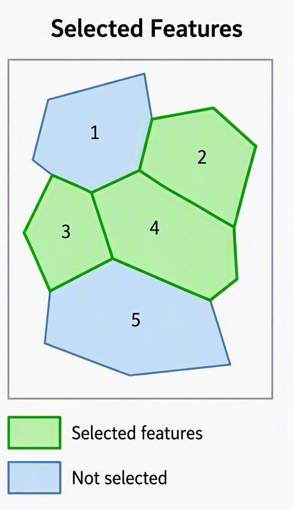{: style="width: 50%;" }

=== "_clip_"

    [**_CLIP_**](https://pro.arcgis.com/en/pro-app/latest/tool-reference/analysis/clip.htm) 
    Vyřezává část jednoho datasetu na základě hranic jiného. Výsledkem je nový dataset obsahující pouze oblasti uvnitř klipu. _CLIP_ je možné provádět pomocí polygonových, liniových i bodových vrstev, viz dokumentace nástroje.

    <figure class="gallery-figure" markdown>

      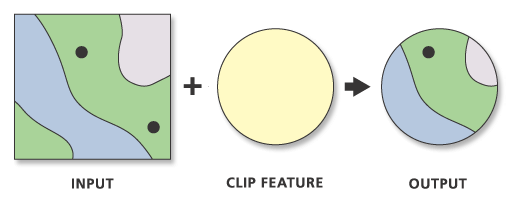

      <figcaption markdown>
        zdroj: [Clip (Analysis Tools)](https://doc.esri.com/en/arcgis-pro/latest/tool-reference/analysis/clip.html?tabs=dialog)
      </figcaption>

    </figure>

=== "*_buffer_*"

    [**_BUFFER_**](https://pro.arcgis.com/en/pro-app/latest/tool-reference/analysis/buffer.htm) 
    Vytváří zóny okolo vstupních geografických prvků ve specifikované vzdálenosti. Tyto zóny mohou být využity například k analýze vlivu určitého objektu na své okolí.

    <figure class="gallery-figure" markdown>

      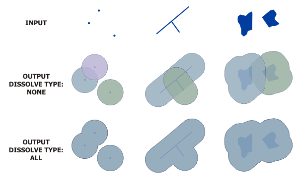

    <figcaption markdown>
      zdroj: [Buffer (Analysis Tools)](https://pro.arcgis.com/en/pro-app/latest/tool-reference/analysis/buffer.htm)
    </figcaption>

    </figure>

=== "*_dissolve_*"

    [**_DISSOLVE_**](https://doc.esri.com/en/arcgis-pro/latest/tool-reference/data-management/dissolve.html?tabs=dialog) 
    Agreguje prvky podle specifického atributu, čímž redukuje počet prvků a vytváří větší jednotky (např. sloučení polygonů stejného typu).

    <figure class="gallery-figure" markdown>

      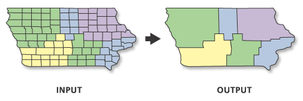

      <figcaption markdown>
       zdroj: [Dissolve (Analysis Tools)](https://doc.esri.com/en/arcgis-pro/latest/tool-reference/data-management/dissolve.html?tabs=dialog)
      </figcaption>

    </figure>

=== "*_intersect_*"

    [**_INTERSECT_**](https://pro.arcgis.com/en/pro-app/latest/tool-reference/analysis/intersect.htm) 
    Kombinuje dvě nebo více vstupních vrstev a vytváří nové prvky v místech, kde se jejich geometrie překrývají.

    <figure class="gallery-figure" markdown>

      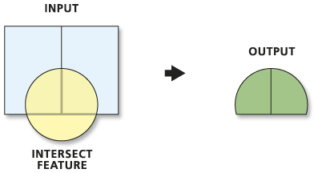

      <figcaption markdown>
       zdroj: [Intersect (Analysis Tools)](https://doc.esri.com/en/arcgis-pro/latest/tool-reference/analysis/intersect.html?tabs=dialog)
      </figcaption>

    </figure>

=== "*_erase_*"

    [**_ERASE_**](https://pro.arcgis.com/en/pro-app/latest/tool-reference/analysis/erase.htm) 
    Odstraňuje části jedné vrstvy, které se překrývají s druhou vstupní vrstvou, a ponechává zbytek geometrie.

    <figure class="gallery-figure" markdown>

      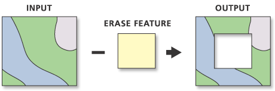

      <figcaption markdown>
      zdroj: [Erase (Analysis Tools)](https://pro.arcgis.com/en/pro-app/latest/tool-reference/analysis/erase.htm)
      </figcaption>

    </figure>

=== "*_union_*"

    [**_UNION_**](https://pro.arcgis.com/en/pro-app/latest/tool-reference/analysis/union.htm) 
    Kombinuje geometrie a atributy dvou nebo více vrstev do nové vrstvy. Výsledkem jsou oblasti, které reprezentují kombinaci všech vstupů.

    <figure class="gallery-figure" markdown>

      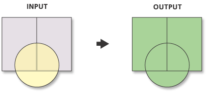

      <figcaption markdown>
      zdroj: [Union (Analysis Tools)](https://pro.arcgis.com/en/pro-app/latest/tool-reference/analysis/union.htm)
      </figcaption>

    </figure>

=== "*_remove overlap_*"

    [**_REMOVE OVERLAP_**](https://pro.arcgis.com/en/pro-app/latest/tool-reference/analysis/remove-overlap-multiple.htm) 
    Identifikuje a odstraňuje překrývající se oblasti mezi prvky v jedné vrstvě nebo mezi více vrstvami.

    <figure class="gallery-figure" markdown>

      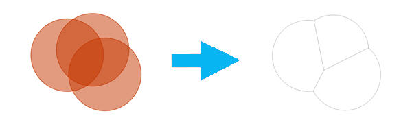

      <figcaption markdown>
      zdroj: [Remove overlap (Analysis Tools)](https://pro.arcgis.com/en/pro-app/latest/tool-reference/analysis/remove-overlap-multiple.htm)
      </figcaption>

    </figure>

=== "*_sym. difference_*"

    [**_SYMMETRICAL DIFFERENCE_**](https://pro.arcgis.com/en/pro-app/latest/tool-reference/analysis/symmetrical-difference.htm) 
    Vytváří novou vrstvu obsahující prvky, které jsou v jedné nebo druhé vstupní vrstvě, ale ne v jejich překryvu.

    <figure class="gallery-figure" markdown>

      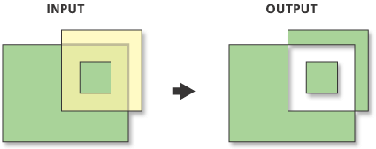

      <figcaption markdown>
      zdroj: [Symmetrical difference (Analysis Tools)](https://pro.arcgis.com/en/pro-app/latest/tool-reference/analysis/symmetrical-difference.htm)
      </figcaption>

    </figure>

=== "*_count overlapping_*"

    [**_COUNT OVERLAPPING FEATURES_**](https://pro.arcgis.com/en/pro-app/latest/tool-reference/analysis/count-overlapping-features.htm) 
    Počítá počet prvků, které se překrývají, a výsledek ukládá do nové vrstvy nebo atributové tabulky.

    <figure class="gallery-figure" markdown>

      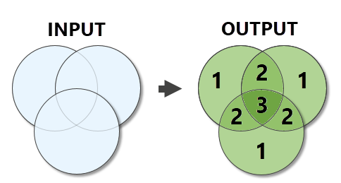

      <figcaption markdown>
      zdroj: [Count overlapping features (Analysis Tools)](https://pro.arcgis.com/en/pro-app/latest/tool-reference/analysis/count-overlapping-features.htm)
      </figcaption>

    </figure>

=== "*_spatial join_*"

    [**_SPATIAL JOIN_**](https://pro.arcgis.com/en/pro-app/latest/tool-reference/analysis/spatial-join.htm) 
    Kombinuje atributy dvou geografických vrstev na základě jejich prostorového vztahu (např. připojení údajů bodů k blízkým polygonům).

    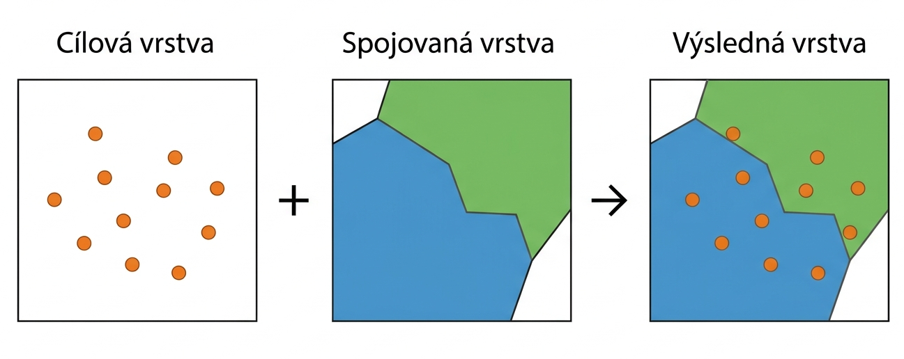

## Použité datové podklady

[RÚIAN](../../data/#ruian)

[Data50](../../data/#data50)
<!---
### [RÚIAN](https://cuzk.gov.cz/ruian/RUIAN/Informace-o-RUIAN.aspx)
Registr územní identifikace, adres a nemovitostí (RÚIAN) je jedním ze čtyř základních registrů veřejné správy ČR. Spravuje ho Český úřad zeměměřický a katastrální (ČÚZK). Obsahem RÚIAN jsou **popisné a lokalizační údaje o územních prvcích, územně evidenčních jednotkách, účelových prvscích, adresách a jejich vzájemných vazbách.**  

Data jsou poskytována jako:  

- veřejný dálkový přístup (VDP)
- služby
- výměnný formát RÚIAN (VFR)
- CSV
- další
    - [SHP](https://services.cuzk.gov.cz/)
    - [WMS](https://ags.cuzk.gov.cz/arcgis/rest/services/RUIAN/MapServer)

### [Data250](https://geoportal.cuzk.cz/(S(qxemhnh2v4kkxkphjtknnhyq))/Default.aspx?menu=2291&mode=TextMeta&side=mapy_data250&metadataID=CZ-CUZK-DATA250-V)
Data250 představují digitální geografický model České republiky v měřítku 1:250 000. Obsah databáze je tematicky strukturován do **osmi skupin: administrativní hranice, vodstvo, doprava, sídla, popis, různé objekty, porost a pvrch půdy, výškopis.** Jsou poskytována ve dvou souřadnicových systémech: S-JTSK a ETRS89.
Výdejním formátem je **SHP**. 

### [Data50](https://geoportal.cuzk.cz/(S(e5piqpx25twcrhhaacj1n4jn))/Default.aspx?menu=22901&mode=TextMeta&side=mapy_data50&metadataID=CZ-CUZK-DATA50-V)
Data50 stejně jako Data250 představují digitální geografický model ČR, tentokrát v podrobnějším měřítku 1:50 000. Vznikla odvozením kartografické databáze pro Základní topografickou mapu ČR 1:50 000 a jsou poskytována ve formátu **SHP**. Data50 jsou rozdělena do osmi tematických oblastí: **Sídelní, kulturní a hospodářské objekty, Komunikace, Produktovody a elektrické vedení, Vodstvo, Hranice územních jednotek, Vegetace a povrch, Terénní reliéf a Popis.** Data jsou poskytována ve dvou souřadnicových systémech: S-JTSK a ETRS89. 
--->

## Procvičování jednotlivých funkcí

**1. úloha** - Vyberte z RÚIAN všechna ORP, která patří do okresu Tachov a uložte je do nové vrstvy. Kolik takových ORP je a jak se jmenují?

??? napoveda "Nápověda"

    Podíváme se do atributové tabulky a zjistíme, zda v ní není atribut související s označením okresu.

    Tabulka obsahuje pole _Nadřazený okres_. Kód okresu Tachov je 3410. Pomocí funkce _SELECT_ vybereme všechny ORP, které splňují podmínku _Nadřazený okres_ = 3410.

??? success "Řešení"

    Počet ORP: 2 - Stříbro a Tachov.

**2. úloha** - Vyberte z RÚIAN všechny obce, které patří do okresu Tachov a uložte je do nové vrstvy. Kolik obcí se v okrese nachází?

??? napoveda "Nápověda"

    Podíváme se do atributové tabulky a zjistíme, zda v ní není atribut související s označením okresu.

    Tabulka obsahuje pole _Nadřazený okres_. Kód okresu Tachov je 3410. Pomocí funkce _SELECT_ vybereme všechny obce, které splňují podmínku _Nadřazený okres_ = 3410.

??? success "Řešení"

    51 obcí

**3. úloha** - Ořízněte vrstvu vodních toků podle hranice ORP Tachov. Jaká je celková délka?

??? napoveda "Nápověda"
     Použijte funkci _CLIP_

??? success "Řešení"

    1 373,815 km

**4. úloha** - Ořízněte všechny tematické vrstvy dle hranice zvoleného území.

??? tip "Jak oříznout několik vrstev najednou?"

    Použijte variantu **_Batch Clip_**.

    1. Vyhledejte nástroj _Clip_ v geoprocessingu a klikněte na něj pravým tlačítkem myši. Vyberte možnost _Batch_.

    2. Potvrďte nastavení nástroje tlačítkem _Next_.

    3. Nyní jste vytvořili dočasný _Batch Clip_, který může mít na vstupu více vrstev.

**5. úloha** - Vytvořte obslužnou zónu 2 km kolem železničních stanic.
??? napoveda "Nápověda"
     Použijte funkci _BUFFER_

**6. úloha** - Vytvořte ochranné pásmo 60 m kolem železničních tratí.
??? napoveda "Nápověda"
     Použijte funkci _BUFFER_

**7. úloha** - Slučte obce podle pověřeného obecního úřadu (_POU_). Kolik polygonů vzniklo?
??? napoveda "Nápověda"
     Použijte funkci _DISSOLVE_

??? success "Řešení"

    5

**8. úloha** - Kolik km dálnic prochází lesy v ORP Tachov?

??? napoveda "Nápověda"

    Nejprve nalezneme všechny komunikace, které jsou označeny jako dálnice a poté můžeme provést funkci _INTERSECT_. _Output Type_ nastavíme na linii.

??? success "Řešení"

    136 km.

**9. úloha** - Zjistěte, o kolik hektarů se zmenší celková rozloha lesních ploch v ORP Tachov po vyloučení území rašelinišť, močálů a bažin.

??? napoveda "Nápověda"
     Použijte funkci _ERASE_ a poté porovnejte novou vrstvu s původní.

??? success "Řešení"

    353,7 ha.

**10. úloha** - Vytvořte vrstvu _Vegetace_, která bude obsahovat lesy, louky a pastviny.

??? napoveda "Nápověda"

    Použijte funkci _UNION_.

**11. úloha** - Vytvořte vrstvu znázorňující překryv 2 km obslužných zón železničních stanic. Zjistěte, kolikrát se v jednotlivých částech území překrývá dostupnost jednotlivých železničních stanic.

??? napoveda "Nápověda"

    Využijte vrstvu pro buffer 2 km železničních stanic.

    Pomocí funkce _COUNT OVERLAPPING FEATURES_ vypočítáte, kde a kolikrát se jednotlivé zóny překrývají.

**12. úloha** - Kolik adresních míst se nachází v obcích okresu Tachov?

??? napoveda "Nápověda"

    Chceme do polygonové vrstvy obcí přidat informaci o počtu adresních míst. _Target Features_ jsou polygony obcí a _Join Features_ je vrstva adresních míst.

    _Join Operation_ je v tomto případě _One to one_.

**13. úloha** - Odstraňte překrývající se části 2 km obslužných zón kolem železničních stanic.

??? napoveda "Nápověda"
    Použijte funkce _REMOVE OVERLAP_.

<!--
### _REMOVE OVERLAP_

### _SYMMETRICAL DIFFERENCE_
--->

## Úlohy k procvičení

!!! task-fg-color "Úlohy"
    Pro řešení následujících úloh využijte data RÚIAN a DATA50. Pracujte nad územím celé republiky, zadaným územím nebo územím dle vašeho výběru.

    1. Jaká je výměra (v ha) lesních ploch, které se nachází v bezprostřední blízkosti vodních ploch (do 100 m)? Kolik procent z celkové výměry lesů v území tvoří?

    2. Kolik budov se nachází do 50 m od silnic? Jaký podíl všech budov to představuje?

    3. Kolik procent území okresu Ústí nad Orlicí tvoří vodní plochy?
    
    4. Jaká je výměra (v km^2^) území omezeného pouze na ČR do 100 m od dálnic?

    5. Jaká je výměra (v ha) bažin a rašelinišť ležících v lese. Kolik to je procent z celkové výměry bažin a rašelinišť?

    6. Jaká je výměra (v ha) bažin a rašelinišť ležících v lese na celém území ČR. Kolik to je procent z celkové výměry bažin a rašelinišť?

    7. Kolik obcí leží celou svou plochou do vzdálenosti 5 km od železniční stanice v rámci okresu Domažlice? Jaká je jejich celková výměra?

    8. Určete všechna místa, kde dochází ke křížení cest a vodních toků na území okresu Tachov. Výsledek prezentujte jako bodovou vrstvu.

    K řešení **následujích** úloh použijte datovou sadu [ArcČR
    500](../../data/#arccr-500) verzi 3.3 dostupnou na disku *S* ve složče
    ``K155\Public\data\GIS\ArcCR500 3.3``. Zde také **najdete** souboru s
    popisem dat ve formátu PDF.

    1. Jaká je výměra (v ha) bažin a rašelinišť ležících v lese. Kolik to
       je procent z celkové výměry bažin a rašelinišť?
       
    2. Jaká je výměra (v km^2^) území omezeného pouze na ČR do 100 m od dálnic?

    3. Kolik obcí v ČR leží celou svojí plochou do vzdálenosti 10 km od
       řeky Labe. Jaký je celkový počet obyvatel těchto obcí?

    4. Na kolika místech kříží dálnice, rychlostní silnice či silnice
       1.třídy s železnicí. Kolik z těchto křížení leží do vzdálenosti 1km
       od nejbližší železniční stanice?

    5. Jaká je výměra území (v ha), na kterých leží les či vodní
       plocha. Existuje území, které by odpovídalo současně oběma
       podmínkám?

    6. Vytvořte společnou datovou vrstvu pro letiště a železniční
       stanice. Kolik objektů tato vrstva obsahuje?

    7. Kolik procent z celkové výměry ČR činí uzemí, která jsou vzdálená
       od nejbližšího rybníku více než 25 km?

    8. Jaká je výměra uzemí ČR (v km^2^), která leží dále než 5 km od
       nejbližší silnice a zároveň dále než 10 km od nejbližší železniční
       stanice? Na území kterých obcí leží největší z hledaných lokalit?

    9. Kolik procent území Jihočeského kraje tvoří vodní plochy?

