# Rastrová data, tvorba digitálního modelu terénu

## Cíl cvičení

Seznámení se s rastrovými daty v GIS a ukázka využití těchto dat. 

## Základní pojmy

- **rastr** – datová struktura založená na buňkách uspořádaných do řádek a sloupců, kde hodnota každé buňky reprezentuje hodnotu jevu
- [**rastrová data**](https://pro.arcgis.com/en/pro-app/latest/help/data/imagery/introduction-to-raster-data.htm) – prostorová data vyjádřená formou matice buněk nebo pixelů; spojitá data (nejčastěji digitální modely terénu, digitalizované mapy)
- [**pixel (buňka)**](https://pro.arcgis.com/en/pro-app/latest/help/data/imagery/pixel-size-of-image-and-raster-data-pro-.htm) – základní geometrický prvek zpravidla čtvercového tvaru; jeho množina vytváří rastrový digitální obraz; 1 buňka = 1 hodnota
- [**prostorové rozlišení rastru**](https://pro.arcgis.com/en/pro-app/latest/tool-reference/environment-settings/cell-size.htm) – velikost 1 buňky (pixelu) rastru (cell size)
- [**resample**](https://pro.arcgis.com/en/pro-app/latest/tool-reference/data-management/resample.htm) – změna prostorového rozlišení rastru
- **digitální model terénu (DMT)** – digitální reprezentace prostorových objektů (obecný pojem obsahující různé způsoby vyjádření terénního reiéfu nebo povrchu)
- **digitální model reliéfu (DMR)** – digitální reprezentace zemského povrchu (NEobsahuje vegetaci a lidské stavby)
- **digitální model povrchu (DMP)** – digitální reprezentace zemského povrchu (obsahuje vegetaci a lidské stavby, které jsou pevně spojené s reliéfem)
- [**pyramidování rastru**](https://pro.arcgis.com/en/pro-app/latest/help/data/imagery/raster-pyramids.htm) – ukládání dat do menšího rozlišení pro rychlejší práci; pyramidy (náhledy) jsou uloženy v souborech *.ovr*

???+ note "&nbsp;Digitální modely terénu České republiky"
     - **DMP 1G** – Digitální model povrchu České republiky 1. generace (DMP 1G) představuje zobrazení území včetně staveb a rostlinného pokryvu ve formě nepravidelné sítě výškových bodů (TIN) s úplnou střední chybou výšky **0,4 m** pro přesně vymezené objekty (budovy) a **0,7 m** pro objekty přesně neohraničené (lesy a další prvky rostlinného pokryvu). Model vznikl z dat pořízených metodou leteckého laserového skenování výškopisu území České republiky v letech 2009 až 2013. 
     - **DMR 4G** – Digitální model reliéfu České republiky 4. generace (DMR 4G) představuje zobrazení přirozeného nebo lidskou činností upraveného zemského povrchu v digitálním tvaru ve formě výšek diskrétních bodů v pravidelné síti (5 x 5 m) bodů o souřadnicích X,Y,H, kde H reprezentuje nadmořskou výšku ve výškovém referenčním systému Balt po vyrovnání (Bpv) s úplnou střední chybou výšky **0,3 m** v odkrytém terénu a **1 m** v zalesněném terénu. Model vznikl z dat pořízených metodou leteckého laserového skenování výškopisu území České republiky v letech 2009 až 2013.
     - **DMR 5G** – Digitální model reliéfu České republiky 5. generace (DMR 5G) představuje zobrazení přirozeného nebo lidskou činností upraveného zemského povrchu v digitálním tvaru ve formě výšek diskrétních bodů v nepravidelné trojúhelníkové síti (TIN) bodů o souřadnicích X,Y,H, kde H reprezentuje nadmořskou výšku ve výškovém referenčním systému Balt po vyrovnání (Bpv) s úplnou střední chybou výšky **0,18 m** v odkrytém terénu a **0,3 m** v zalesněném terénu. Model vznikl z dat pořízených metodou leteckého laserového skenování výškopisu území České republiky v letech 2009 až 2013. Dokončen byl k 30. 6. 2016 na celém území ČR. (Zdroj: ČÚZK)

## Použité datové podklady

- [ArcČR 500](../../data/#arccr-500)
- [Císařské otisky stabilního katastru](../../data/#cisarske-otisky-stabilniho-katastru)
- [DMR 4G](../../data/#dmr-5g)

## Náplň cvičení

### Ukázka nejčastějších rastrových typů dat

-   :material-elevation-rise:{ .lg .middle height} __Digitální model terénu/reliéfu__

    ---

    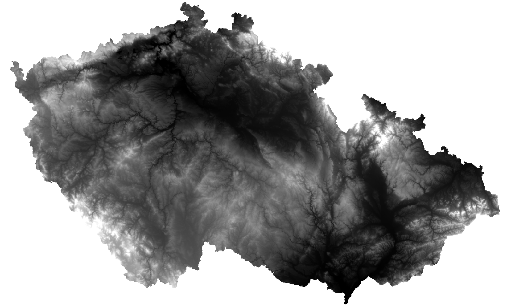

-   :material-grid:{ .lg .middle } __Stínovaný reliéf__

    ---

    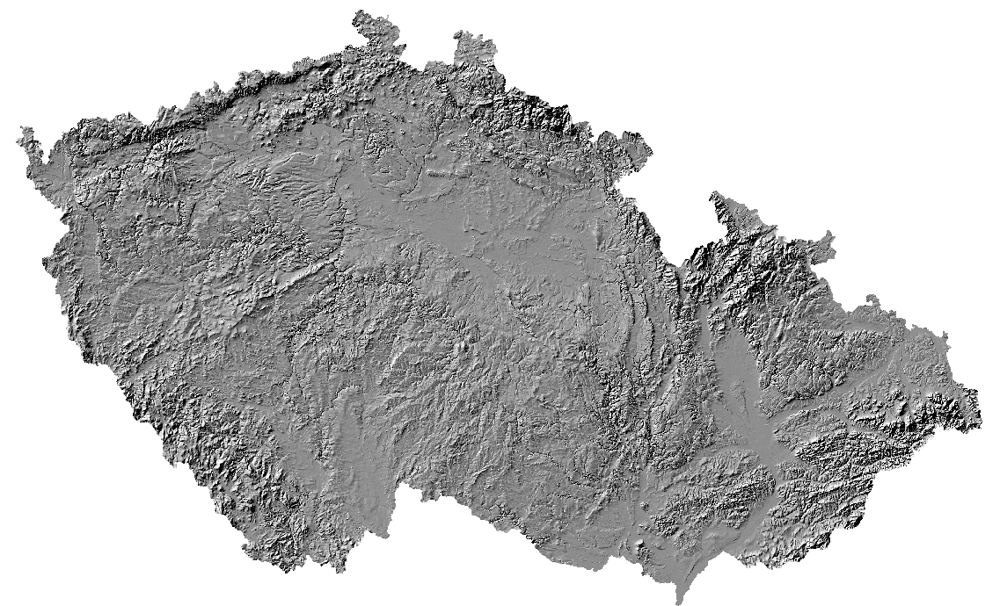

-   :material-map:{ .lg .middle } __Naskenovaný mapový list__

    ---
    

-   :material-airplane:{ .lg .middle } __Ortofoto__

    ---
    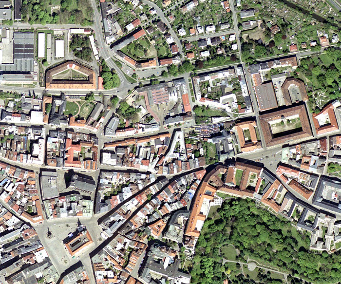

-   :fontawesome-solid-satellite:{ .lg .middle } __Družicová data__

    ---
    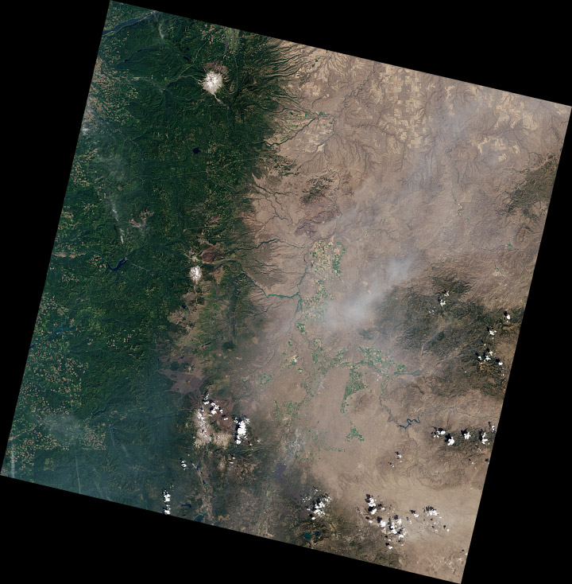

### Práce s digitálním modelem reliéfu

**Zdroj dat** – DMR 4G ([ArcČR 500](../../data/#arccr-500))  
DMR 4G představuje hodnoty nadmořské výšky pro Českou republiku s rozlišením 5x5 metrů. Verze z ArcČR je však převzorkovaná a má velikost 1 pixelu 50x50 metrů.

**1.** Načteme DMR 4G z databáze ArcČR (vrstva _:simple-databricks: DigitalniModelReliefu_{: .outlined_code}).

**2.** Zjištění prostorového rozlišení rastru (pravý klik na daný rastr v záložce _:material-tab: Contents_{: .outlined_code} → _:material-form-dropdown: Properties_{: .outlined_code} → _:material-button-cursor: Source_{: .outlined_code} → _:material-button-cursor: Raster Information_{: .outlined_code} → _:material-button-cursor: Cell Size X/Y_{: .outlined_code}).

**3.** Vybereme okres pro ořez rastru (vrstva _:simple-databricks: OkresyPolygony_{: .outlined_code}).

**4.** Export vybraného okresu do samostatné vrstvy provedeme přes pravý klik myši na vybranou vrstvu → _:material-form-dropdown: Data_{: .outlined_code} → _:material-form-dropdown: Export Features_{: .outlined_code}.

<figure markdown>
  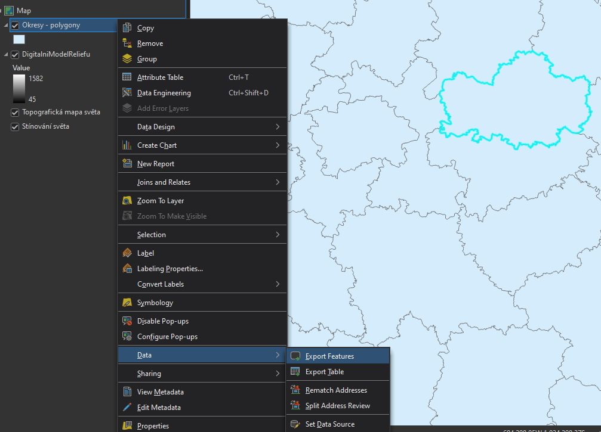{ width="800" }
  <figcaption>Export features</figcaption>
</figure>

**5.** Ořez rastru lze provést několika způsoby. Nejjednodušší možností je funkce [_:material-cog: **Clip Raster**_{: .outlined_code}](https://pro.arcgis.com/en/pro-app/latest/tool-reference/data-management/clip.htm), která vytvoří ořez dle nejmenšího ohraničujícího obdélníku.

<figure markdown>
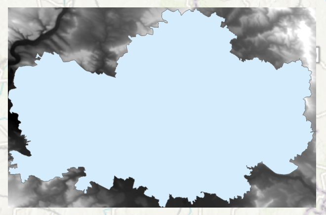
    <figcaption>Clip raster</figcaption>
</figure>

**6.** Další možností je funkce [_:material-cog: **Extract by Mask**_{: .outlined_code}](https://pro.arcgis.com/en/pro-app/latest/tool-reference/spatial-analyst/extract-by-mask.htm), jež ořízne rastr přesně dle polygonu (s přesností na pixely).

<figure markdown>
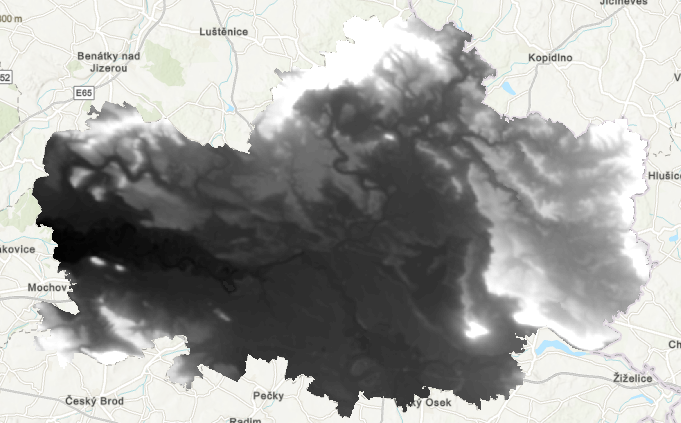
    <figcaption>Extract by mask</figcaption>
</figure>

### Ukázka změny symbologie rastru

Rastrovým vrstvám lze (stejně jako vektorovým) měnit vzhled v záložce [_:material-tab: Symbology_{: .outlined_code} ](https://pro.arcgis.com/en/pro-app/latest/help/data/imagery/symbology-pane.htm). Nabídka se zobrazí pravým klinutím myši na danou vrstvu → _:material-form-dropdown: Symbology_{: .outlined_code}.

<figure markdown>
  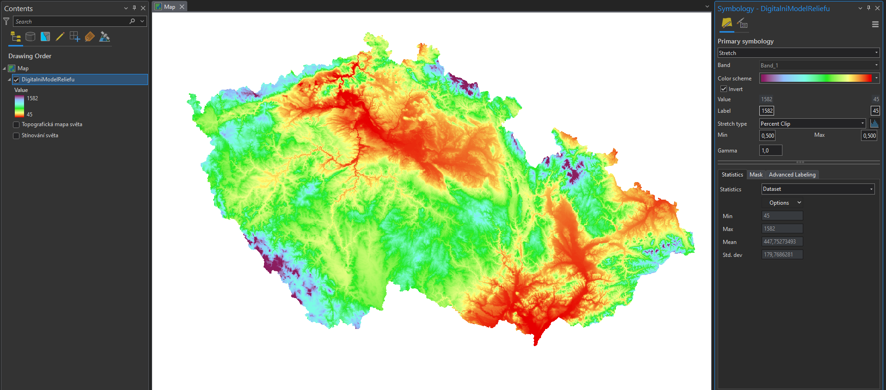
  <figcaption>Nastavení symbologie DMR</figcaption>
</figure>

### Processing templates

Processing templates jsou šablony, které se používají pro získání různých informací z dané vrstvy. Podkladem je stále jedna datová sada (např. [DMR5G](https://ags.cuzk.gov.cz/arcgis2/rest/services/dmr5g/ImageServer)), na kterou je však dle zvolení aplikována šablona, pomocí které se data rastru různě zpracují. Ve výsledku tímto způsobem dokážeme z jednoho rastru získat informace například o reálných výškách terénu, stínovaném reliéfu či vypočtené sklonitosti svahů. Ne všechny služby tyto šablony nabízejí k dispozici.

Dostupné šablony pro konkrétní rastrovou službu najdeme v záložce _:material-tab: Data_{: .outlined_code} po vybrání požadvané vrstvy. Možnosti se zobrazí po rozkliknutí tlačítka _:material-button-cursor: Processing Templates_{: .outlined_code}

<figure markdown>
  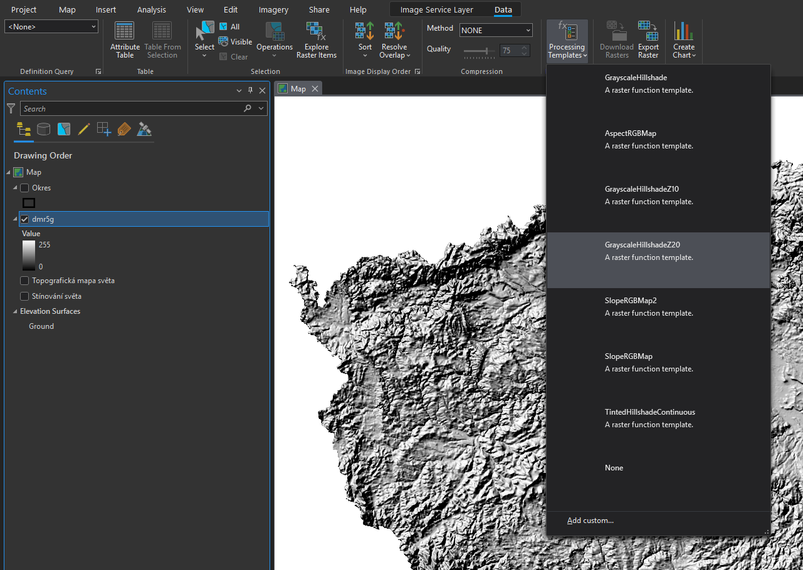{width="800"}
  <figcaption>Zobrazení dostupných processing templates</figcaption>
</figure>

Více o rastrových funkcích bude součástí předmětu [GIS 2](https://k155cvut.github.io/gis-2/). 

-   __Reálné výšky terénu (None)__

    ---

    

-   __Stínovaný reliéf (GrayscaleHillshade)__

    ---

    

-   __Sklonitost terénu (SlopeRGBMap)__

    ---
    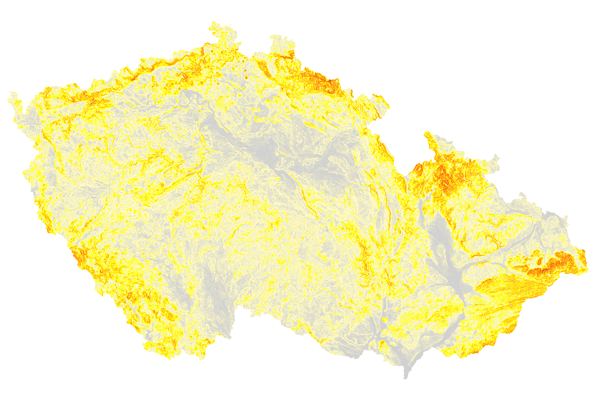

-   __Orientace terénu na světovou stranu (AspectRGBMap)__

    ---
    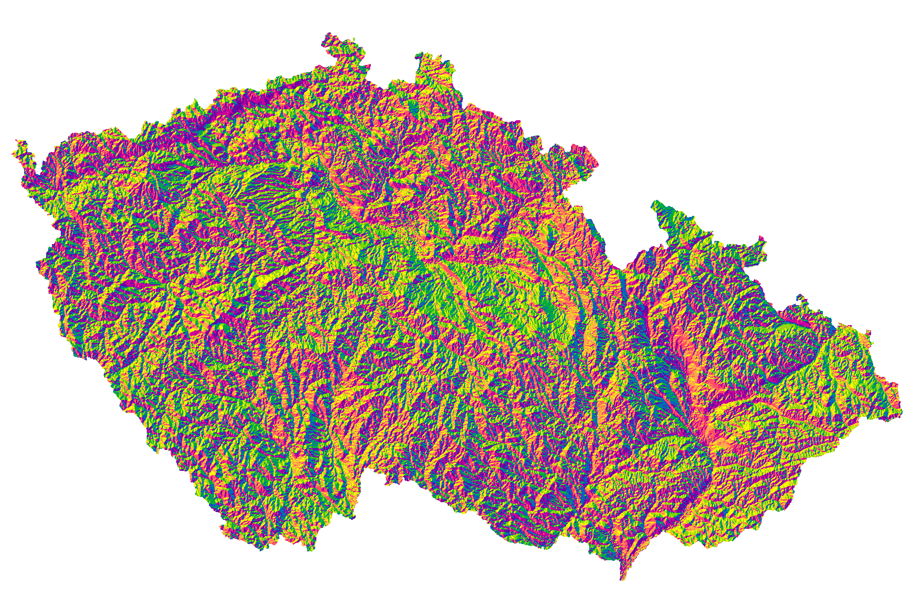

