# Georeferencování, vektorizace, tvorba geodatabáze, kontrola topologie

## Cíl cvičení

Souřadnicové připojení rastrových dat. Práce s Mosaic Dataset. Ukázka automatického ořezu footprintu. Tvorba vlastní geodatabáze, vektorizace a práce s atributy. Kontrola topologie vektorových dat.

## Základní pojmy

- [**transformace**](https://pro.arcgis.com/en/pro-app/latest/help/mapping/properties/geographic-coordinate-system-transformation.htm) – obecný pojem pro výpočet, jehož cílem je převod souřadnic bodů z jednoho souřadnicového systému do druhého

- [**georeference**](https://pro.arcgis.com/en/pro-app/3.0/help/data/imagery/overview-of-georeferencing.htm) – souřadnicové určení snímku

- [**mosaic dataset**](https://pro.arcgis.com/en/pro-app/latest/help/data/imagery/mosaic-datasets.htm) – mozaika; datová sada sjednocující jeden či více rastrů; umožňuje ořez mimorámových údajů

- [**geodatabáze**](https://pro.arcgis.com/en/pro-app/3.0/help/data/geodatabases/overview/what-is-a-geodatabase-.htm) – prostředí pro správu bází geografických dat

- [**dataset**](https://pro.arcgis.com/en/pro-app/latest/help/data/feature-datasets/feature-datasets-in-arcgis-pro.htm) – soubor shrnující pod sebe vybrané třídy prvků se stejným souřadnicovým systémem

- **vektorizace** – přepracování mapy v analogové formě, popř. digitální mapy v rastrové formě do vektorové formy

- [**třída prvků**](https://pro.arcgis.com/en/pro-app/3.0/help/data/geodatabases/overview/feature-class-basics.htm) – homogenní kolekce společných prvků, z nichž má každý stejnou prostorovou reprezentaci (např. body, linie nebo polygony) a společnou sadu sloupců atributů

- [**subtyp**](https://pro.arcgis.com/en/pro-app/latest/help/data/geodatabases/overview/an-overview-of-subtypes.htm) – množina prvků v tabulce, které mají stejné atributy; používají se pro kategorizaci dat

- [**topologie**](https://pro.arcgis.com/en/pro-app/latest/help/data/topologies/topology-in-arcgis.htm) – definování struktury prvků geosystému na základě jejich vztahů konektivity (vzájemného spojení) a kontinuity (vzájemné polohy)

## Použité datové podklady

- [Císařské otisky stabilního katastru](../../data/#cisarske-otisky-stabilniho-katastru)
- [Státní mapa 1 : 5 000 – odvozená](../../data/#statni-mapa-1-:-5-500-0-–-odvozena)
- klad SMO5

## Náplň cvičení

### Georeferencování rastru

**Zdroj dat** – ČÚZK

**Návod ke georeferencování:**

**1.** Načtení rastru do mapového okna z adresáře v záložce _:material-tab: Catalog_{: .outlined_code} . Rastr se umístí po počátku aktuálního souřadnicového systému. Přiblížit se na něj lze po kliknutí pravým tlačítkem na jeho název v záložce _:material-tab: Contents_{: .outlined_code}  → _:material-form-dropdown: Zoom To Layer_{: .outlined_code} .

**2.** Následně zapneme funkci Georeference: záložka _:material-tab: Imagery_{: .outlined_code}  → _:material-button-cursor: Georeference_{: .outlined_code} .

<figure markdown>
  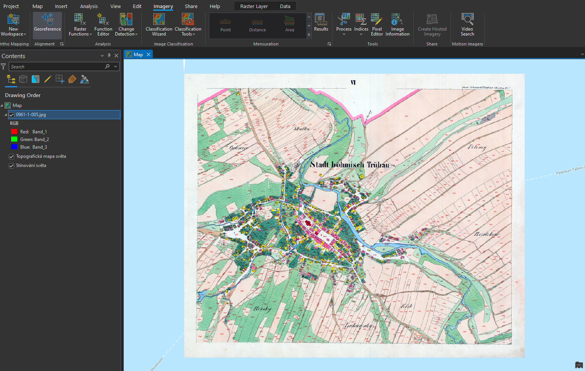
  <figcaption>Georeferencování rastru</figcaption>
</figure>

**3.** V nástroji _:material-button-cursor: Georeference_{: .outlined_code} je potřeba nastavit identické body, na základě kterých se mapový list transformuje do souřadnicového systému mapy.

**4.** Mapu přiblížíme na výřez obrazovky tlačítkem _:material-button-cursor: Fit to Display_{: .outlined_code} .

**5.** Pokud již známe identické body, je možné je importovat pomocí _:material-button-cursor: Import Control Points_{: .outlined_code}. Jestliže tyto body nemáme, musíme je ručně vytvořit tlačítkem _:material-button-cursor: Add Control Points_{: .outlined_code} .

**6.** Při vkládání bodů se nejprve určí bod ze vstupního mapového listu (_:material-button-cursor: source_{: .outlined_code}) a následně jeho ekvivalent v mapě (_:material-button-cursor: target_{: .outlined_code}). Důležité je vybírat identické body rovnoměrně po celé ploše mapového listu a ideálně vybírat taková místa, která jsou na obou vrstvách (mapový list a podkladová mapa) totožná. Nejčastěji se jedná o rohy významných budov (kostely), křížení silnic či boží muka. Identické body a jejich přesnost určujeme dle měřítka georeferencované mapy.

**7.** V některých případech je velmi obtížné najít identické body, zejména u starších archiválií. Na příkladu, který je uveden v tomto návodu, je patrná obrovská změna využití ploch v České Třebové.

<figure markdown>
  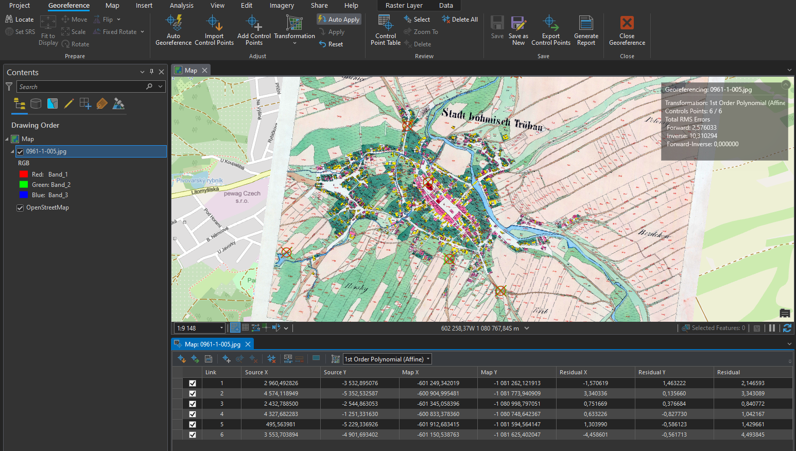
  <figcaption>Georeferencovaný mapový list</figcaption>
</figure>

???+ note "&nbsp;Zadávání souřadnic identických bodů:"
      Pokud známe souřadnice identického bodu, lze je zapsat ručně: klikneme na bod v připojované mapě → pravým kliknutím myši následně otevřeme nabídku, ve které se zadají souřadnice identického bodu v cílové mapě. Tuto metodu lze využít při georeferencování na geodeticky zaměřené body nebo na rohy mapového listů o známých souřadnicích (např. Topografické mapy v systému S–52).

**8.** Během procesu georeference je nutné sledovat přesnost výsledného souřadnicoého umístění dat. Tu na jdeme v tabulce _:material-tab: Control Point Table_{: .outlined_code}  v nástroji _:material-tab: Georeference_{: .outlined_code} . V této tabulce se nachází přehled všech identických bodů včetně jejich souřadnicových přesností. Můžeme zde také body mazat nebo je vyřadit z výpočtu transformace. Body jsou zároveň znázorněny v mapovém okně.

**9.** Při georeferencování v *ArcGIS Pro* lze použít několik druhů souřadnicových transformací. Druh transforamce volíme na základě vstupních dat. Pro ukázku s císařskými otisky stabilního katastru, je ideální afinní transformace, která se nabízí jako výchozí.

**10.** Pokud jsme spokojeni s georeferencováním, uložíme jej tlačítkem _:material-button-cursor: Save_{: .outlined_code} . Jestliže by bylo potřeba, je možné nastavení souřadnicového umístění změnit. Nástroj Georeference můžeme nyní zavřít _:material-button-cursor: Close_{: .outlined_code} .

???+ note "&nbsp;Georeferencování vytvoří pro každý rastr dva další soubory s parametry:"
      - JGWX – transformační klíč

      - XML – informace o souřadnicovém systému a parametrech georeference

### Vytvoření mozaiky

Pro vytvoření ucelené mapové vrstvy a následné zpracování rastrů, se využívá [__Mosaic Dataset__](https://pro.arcgis.com/en/pro-app/latest/help/data/imagery/mosaic-datasets.htm). Do mozaiky přesuneme požadované rastry. Mozaika vygeneruje vektorové vrstvy _:simple-databricks: Footprint_{: .outlined_code} a *:simple-databricks: Boundary*{: .outlined_code}.

  - Footprint slouží k ořezu mimorámových údajů každého rastru
  - Boundary je ohraničení celé mozaiky

**1.** _Mosaic Dataset_ vytvoříme kliknutím pravého tlačítka myši na geodatabázi v záložce _:material-tab: Catalog_{: .outlined_code}  → _:material-form-dropdown: New_{: .outlined_code} → _:material-form-dropdown: Mosaic Dataset_{: .outlined_code}.

<figure markdown>
  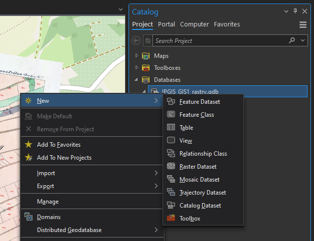
  <figcaption>Vytvoření Mosaic Dataset</figcaption>
</figure>

**2.** V záložce _:material-tab: Geoprocessing_{: .outlined_code} se otevře funkce [_:material-cog: **Create Mosaic Dataset**_{: .outlined_code}](https://pro.arcgis.com/en/pro-app/latest/tool-reference/data-management/create-mosaic-dataset.htm), ve které vyplníme název mozaiky _Mosaic Dataset Name_{: .outlined_code} a příslušný souřadnicový systém _Coordinate System_{: .outlined_code} (ten je vhodné zvolit stejný jako v mapě – _Current Map_{: .outlined_code}). Ostaní parametry ponecháme ve výchozím nastavení.

<figure markdown>
  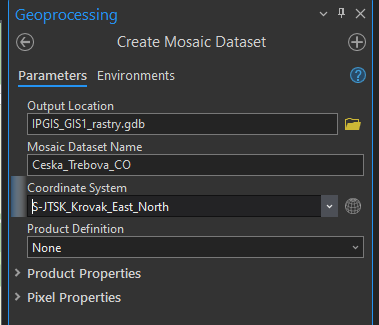
  <figcaption>Vytvoření Mosaic Dataset</figcaption>
</figure>

**3.** Vytvořená mozaika se rovnou přidá do mapy, tudíž její vrstvu vidíme v záložce _:material-tab: Contents_{: .outlined_code}. Mozaika je stále prázdná, musíme do ní tedy přidat georeferencované rastry.

**4.** Pravým kliknutím na mozaiku v záložce _:material-tab: Catalog_{: .outlined_code} → _Add Rasters_ otevřeme funkci importu rastrů do mozaiky. Funkci lze najít i v záložce _:material-tab: Geoprocessing_{: .outlined_code} .

<figure markdown>
  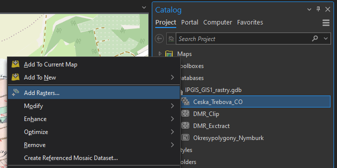
  <figcaption>Přidání rastrů do mozaiky</figcaption>
</figure>

**5.** Ve funkci [_:material-button-cursor: **Add Rasters To Mosaic Dataset**_{: .outlined_code}](https://pro.arcgis.com/en/pro-app/latest/tool-reference/data-management/add-rasters-to-mosaic-dataset.htm) zvolíme výstupní mozaiku a ikonou s plusem v části _Input Data_ nahrajeme soubory. Pokud máme více georeferencovaných rastrů, je vhodné je uchovávat v jedné složce (včetně souborů určujících parametry transformace), kterou pak do mozaiky nahrajeme celou. V jiném případě můžeme nahrát přímo soubor tak, že změníme v *Input Data*{: .outlined_code} možnost _Folder_{: .outlined_code} na _File_{: .outlined_code}. Při výběru souboru v průzkumníku pak změníme CSV na všechny typy souborů a najdeme potřebné soubory. Ostatní parametry nyní ponecháme ve výchozím stavu.

<figure markdown>
  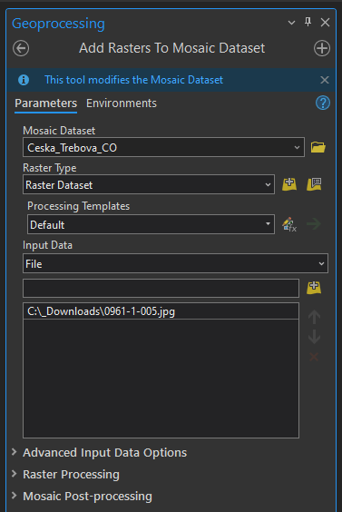
  <figcaption>Přidání rastrů do mozaiky</figcaption>
</figure>

### Editování mozaiky

**1.** Pro vytvoření bezešvé mozaiky je potřeba nastavit hranice vrstvy _:simple-databricks: Footprint_{: .outlined_code} dle požadovaného ořezu dat.

**2.** V záložce _:material-tab: Edit_{: .outlined_code} zvolíme _:material-button-cursor: Edit Vertices_{: .outlined_code} a pro přidání, odebrání či posunutí lomových bodů využíváme nově otevřenou nabídku ikon v dolní části obrazovky. Pro uložení editace musíme stisknout ikonu _Finish_ dole ve zmíněné nabídce ikon a následovně _:material-button-cursor: Save_{: .outlined_code} nahoře vlevo v záložce _:material-tab: Edit_{: .outlined_code}. Vzhledem k tomu, že císařské otisky stabilního katastru jsou mapy bez pravidelného jednotného kladu mapových listů, je nutné editaci _Footprintu_ oklikat ručně. Automatický ořez _Footprintu_ lze použít například na data Státní mapy 1 : 5 000 – odvozené. Tato metoda je probírána v následujícím cvičení.

<figure markdown>
  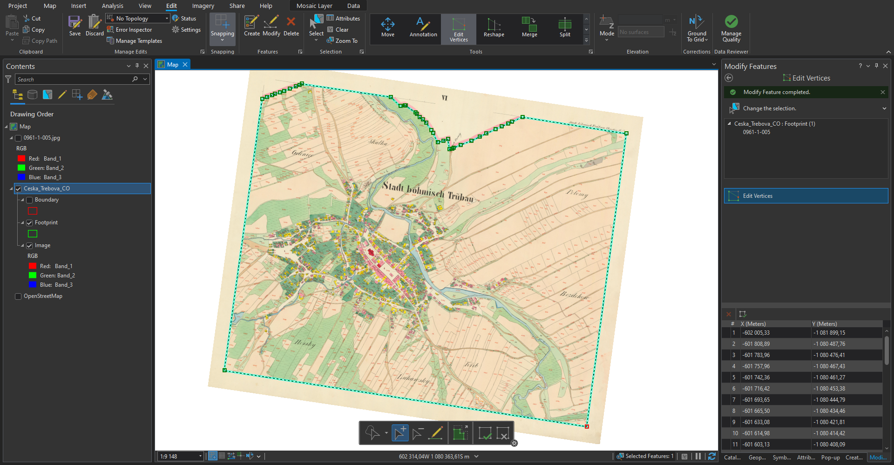
  <figcaption>Editace Footprintu</figcaption>
</figure>

**3.** Při editaci sousedících mapových listů je nutné lomové body přichytit na sebe se zapnutou funkcí _:material-button-cursor: Snapping_{: .outlined_code} v záložce _:material-tab: Edit_{: .outlined_code}. Jinak by nebyla mozaika bezešvá a obsahovala by díry.

**4.** Ořez rastru dle _Footprintu_ je nutné nastavit v parametrech mozaiky: v _:material-tab: Catalogu_{: .outlined_code} → kliknutím pravého tlačítka na mozaiku → _:material-form-dropdown: Properties_{: .outlined_code} → _:material-form-dropdown: Defaults_{: .outlined_code} → zaškrtnout _:octicons-checkbox-24: Always Clip the Raster to its Footprint_{: .outlined_code}. Pokud se nebudou další případné změny _Footprintu_ projevovat v mapě, je potřeba ve stejné nabídce vždy změnit _:material-form-dropdown: Default Mosaic Operator_{: .outlined_code} z *:material-form-dropdown: First*{: .outlined_code} na _:material-form-dropdown: Last_{: .outlined_code} a naopak.

<figure markdown>
  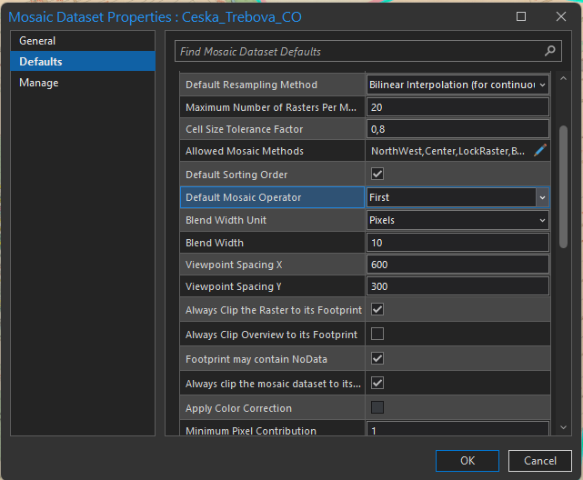
  <figcaption>Parametry mozaiky</figcaption>
</figure>

**5.** Po potvrzení změny parametrů v parametrech mozaiky by se měly oříznout vybrané mimorámové údaje z mapového listu.

<figure markdown>
  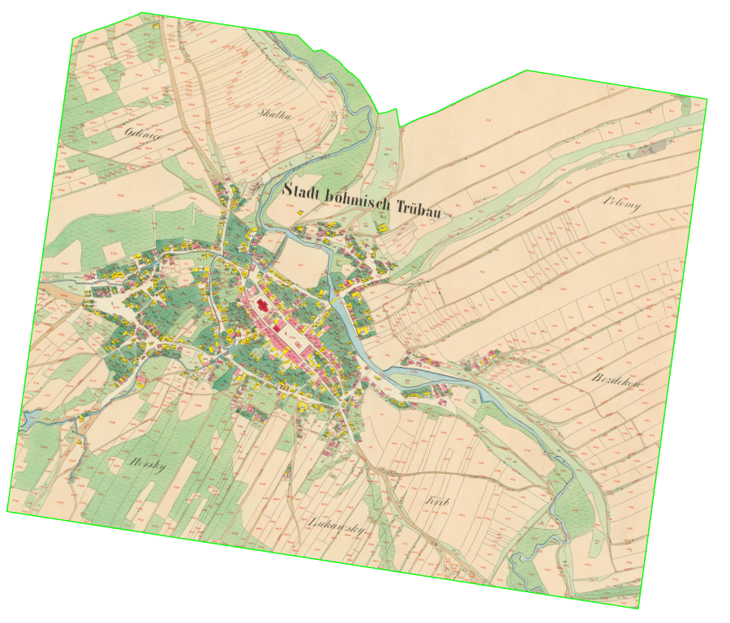{ width="800" }
  <figcaption>Hotová mozaika georeferencovaného mapového listu</figcaption>
</figure>

???+ note "&nbsp;Obnovení cesty k rastrům v mozaice"
      Pokud se změní umístění původních rastrových georeferencovaných souborů, které tvoří mozaiku, je možné cestu k nim jednoduše obnovit. 

      Kliknutím pravého tlačítka myši na danou mozaiku v sekci *:material-tab: Catalog*{: .outlined_code} → _:material-form-dropdown: Modify_{: .outlined_code} → _:material-form-dropdown: Repair Mosaic Dataset Paths..._{: .outlined_code} se nastaví nová cesta k rastrům.

## Úlohy k procvičení

!!! task-fg-color "Úlohy"

    K řešení následujích úloh použijte datovou sadu [ArcČR
    500](../../data/#arccr-500) verzi 3.3 dostupnou na disku *S* ve složče
    ``K155\Public\data\GIS\ArcCR500 3.3``. Zde také najdete souboru s
    popisem dat ve formátu PDF. Další datové vrstvy, která budete
    potřebovat pro vyřešení následujících úloh, jsou dostupné ke stažení
    jako [zip archiv](https://geo.fsv.cvut.cz/vyuka/155gis1/geodata/gis1-cviceni05.zip).

    1. Vizuálně zjistěte jaká je nejvíce zastoupená "barva" podloží v okrese Pelhřimov.

    2. Vizuálně zjistěte na jakém mapovém listu ZM25 leží Mšené Žehrovice.

    3. Vytvořte výsledný rastr, který bude v souřadnicovém systému UTM-33N
       (velikost pixelu 300m). Vrstvu vyexportujte do formátu GeoTIFF.

### Založení nové geodatabáze

**1.** Geodatabázi vytvoříme kliknutím pravým tlačítkem myši na složku našeho projektu v záložce _:material-tab: Catalog_{: .outlined_code} → *:material-form-dropdown: New*{: .outlined_code} → *:material-form-dropdown: File Geodatabase*{: .outlined_code}.

???+ note "&nbsp;Poznámka ke geodatabázi:"
      Takto vytvořenou geodatabázi můžeme otevřít v jakémkoliv GIS softwaru (např. ArcGIS PRO, QGIS). Je proto vhodná pro sdílení dat.

<figure markdown>
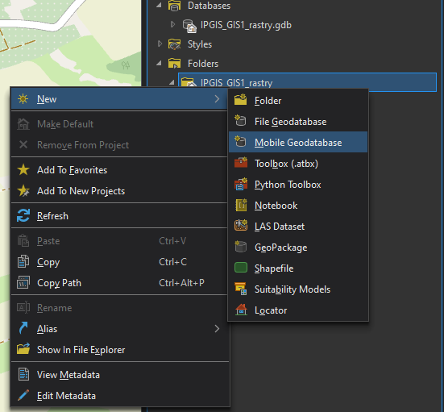
    <figcaption>Tvorba nové geodatabáze</figcaption>
</figure>

### Importu předem georeferencovaného rastru

**1.** Do mapy si načteme částečně georeferencované listy Státní mapy 1 : 5 000 – odvozené (SMO5). Bude nutné negeoreferencované listy souřadnicově umístit.

**2.** Oproti císařským otiskům stabilního katastru, které se georeferencují na identické body v mapě, lze SMO5 georeferencovat na rohové body mapových listů, které mají dané souřadnice v sysému S–JTSK (EPSG:5514). Pro georeferencování použijeme síť kladu mapových listů SMO5 (síť o rozměrech 2,5x2 km).

**3.** Dle postupu z minulého cvičení si případně georeferencujeme zbývající souřadnicově nepřipojené mapové listy. Následně vytvoříme v nové geodatabázi mozaiku, do které georeferencované rastry importujeme.

### Automatický ořez footprintu

Ve stavu, kdy máme přidané georeferencované rastry do mozaiky, je potřeba oříznout jejich footprint tak, aby se vytvořila bezešvá mapová vrstva. Footprint lze upravit ručně (viz minulé cvičení) nebo automaticky načtením kladu mapových listů.

**1.** V mapovém okně otevřeme mozaiku a klad mapových listů. Kladu změníme symbologii tak, abychom viděli pouze hrany listů. 

<figure markdown>
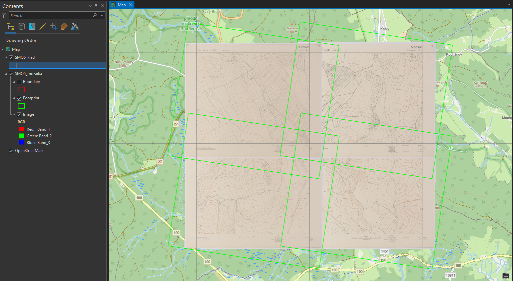
    <figcaption>Mozaika a klad mapových listů v mapovém okně</figcaption>
</figure>

**2.** Před automatickým ořezem footprintů je nutné zkontrolovat pojmenování listů, které musí být jak v mozaice, tak v kladu listů stejné. Případně je potřebný jiný jednoznačný atribut, na základě kterého se obě vrstvy propojí.

<figure markdown>
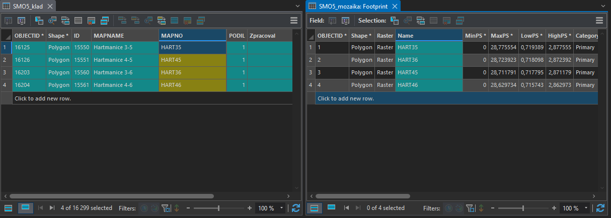{ width="800" }
    <figcaption>Ukázka atributových tabulek předpřipravených vrstev</figcaption>
</figure>

**3.** Automatický ořez footprintu se nastaví pravým kliknutím myši na danou mozaiku → *:material-form-dropdown: Modify*{: .outlined_code} → *:material-form-dropdown: Import Footprints or Boundary*{: .outlined_code}. 

**4.** Ve funkci [*:material-cog: __Import Mosaic Dataset Geometry__*{: .outlined_code}](https://pro.arcgis.com/en/pro-app/latest/tool-reference/data-management/import-mosaic-dataset-geometry.htm) nastavíme parametry dle obrázku níže.

- *Target Feature Class* – vrstva, jejíž geometrii chceme upravit. 

- *Target Join Field* – sloupec s jednoznačným indetifikátorem výstupní vrstvy.

- *Input Feature Class* – ořezová vrstva.

- *Input Join Field* – sloupec s jednoznačným indetifikátorem ořezové vrstvy.

<figure markdown>
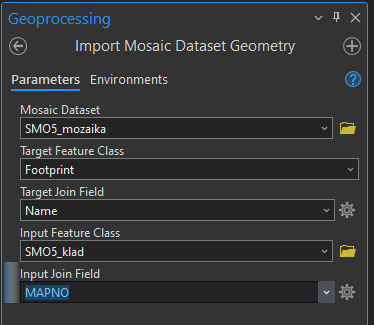
    <figcaption>Nastavení funkce Import Mosaic Dataset Geometry</figcaption>
</figure>

**5.** Výsledek funkce *:material-cog: Import Mosaic Dataset Geometry*{: .outlined_code} je vidět níže.

<figure markdown>
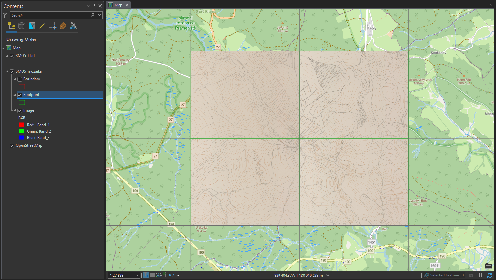
    <figcaption>Výsledek automatického ořezu footprintu</figcaption>
</figure>

### Vytvoření nového datasetu v geodatabázi

**1.** Pro vytvoření souhrného datasetu, ve kterém budeme následně uchovávat některé datové vrstvy, je nutné kliknout pravým tlačítkem na cílovou geodatabázi → *:material-form-dropdown: New*{: .outlined_code} → *:material-form-dropdown: Feature Dataset*{: .outlined_code}.

**2.** Otevře se funkce [*:material-cog: __Create Feature Dataset__*{: .outlined_code}](https://pro.arcgis.com/en/pro-app/latest/tool-reference/data-management/create-feature-dataset.htm), ve které určíme mimo cílové geodatabáze také název a souřadnicový systém datasetu.

<figure markdown>
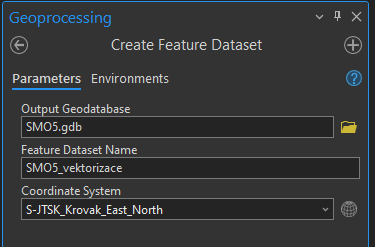
    <figcaption>Vytvoření datasetu</figcaption>
</figure>

### Vektorizace

Pro analýzu rastrových map, je téměř vždy nutná jejich vektorizace, tedy převedení mapy do vektorové podoby. Existují různé možnosti automatizace tohoto procesu, ale my si ukážeme nejjednodušší metodu, kterou je manuální vektorizace.

#### Založení třídy prvků

**1.** Nejprve je nutné vytvořit si třídy, do kterých budeme vektorizaci zakreslovat. Tento krok se samozřejmě liší dle specifik dané práce, ale pro naši ukázku to znamená, že musíme vytvořit třídy pro typy využití pozemků SMO5, kterou budeme vektorizovat:

- plochy – les, louka, pastvina, orná půda, nádvoří, zahrada, hřbitov apod.
- domy – kostel, domy bez značení
- vodstvo – vodní toky, vodní plochy
- cestní síť

???+ note "&nbsp;Tip před tvorbou třídy prvků:"
      Před tvorbou tříd prvků pro vektorizaci rastrové mapy je vhodné nahlédnout do legendy, abychom měli představu o mapovém obsahu.

<figure markdown>
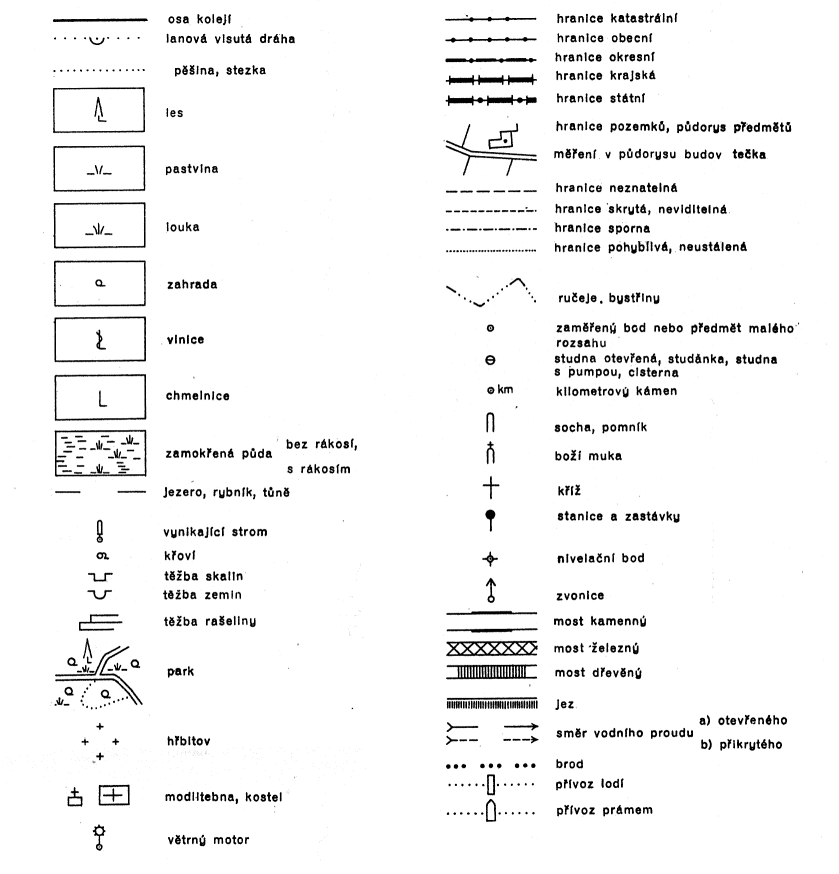{ width="600" }
    <figcaption>Značkový klíč SMO5</figcaption>
</figure>

**2.** Pro vytvoření třídy prvků musíme kliknout pravým tlačítkem na příslušný *:simple-databricks: Feature Dataset*{: .outlined_code} v *:material-tab: Catalogu*{: .outlined_code} → *:material-form-dropdown: New*{: .outlined_code} → *:material-form-dropdown: Feature Class*{: .outlined_code}.

**3.** V této ukázce vytvoříme 4 třídy prvků (plochy, domy, vodstvo a cesty). Ve funkci [*:material-cog: __Create Feature Class__*{: .outlined_code}](https://pro.arcgis.com/en/pro-app/latest/help/data/feature-classes/create-a-feature-class.htm) zvolíme jméno třídy a její typ (pro nás *Polygon*). Následně klikneme na *Next*.

**4.** Na druhé stránce funkce *:material-cog: Create Feature Class*{: .outlined_code} nastavujeme atributová pole třídy. Zde vytvoříme nové pole s názvem *druh_pozemku* po kliknutí na tlačítko *:material-button-cursor: Click here to add a new field*{: .outlined_code}. Datový typ přiřadíme číselný, například *Long Integer*. Tato čísla budou reprezentovat kódy různých druhů pozemku v mapě. Pokračujeme tlačítkem *:material-button-cursor: Next*{: .outlined_code}.

**5.** Na třetí stránce zkontrolujeme souřadnicový systém třídy prvků. Nastavení na dalších stránkách můžeme pomechat ve výchozím stavu.

<figure markdown>
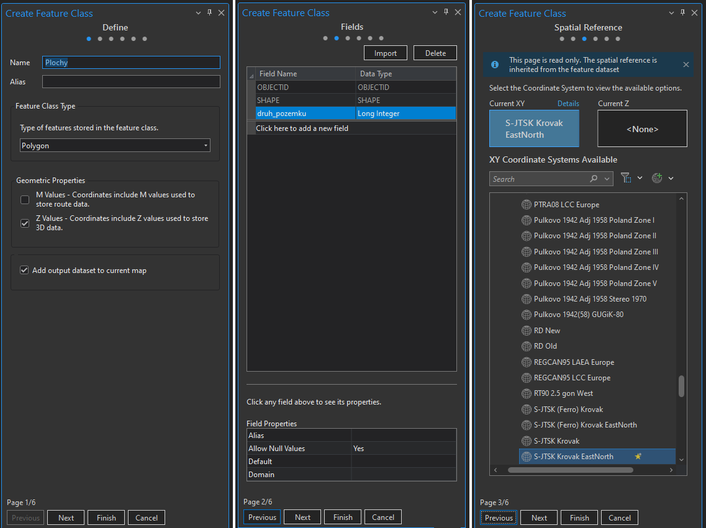{ width="800" }
    <figcaption>Založení třídy prvků</figcaption>
</figure>

#### Práce se subtypy

Pro kategorizaci dat v atributové tabulce je vhodné používat subtypy. V jednoduchosti se jedná o kódy jednotlivých typů atributů v tabulce, kterým je přiřazen popis pro přehlednější práci. V této ukázce vytvoříme subtypy pro třídu prvků *:simple-databricks: Plochy*{: .outlined_code}, který nám bude určovat druh využití pozemku.

**1.** Zobrazíme si atributovou tabulku vrstvy *:simple-databricks: Plochy*{: .outlined_code}. 

**2.** V horní části programu si rozklikneme záložku *:material-tab: Table*{: .outlined_code}

<figure markdown>
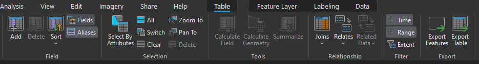{ width="800" }
    <figcaption>Zobrazení polí atributové tabulky</figcaption>
</figure>

**3.** Otevře se nám nová nabídka, ve které zvolíme tlačítko *:material-button-cursor: Subtypes*{: .outlined_code} a následně *:material-button-cursor: Create/Manage*{: .outlined_code}.

<figure markdown>
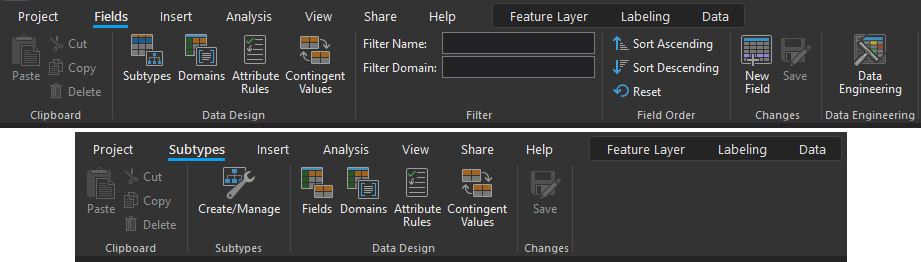{ width="800" }
    <figcaption>Zapnutí editace subtypů</figcaption>
</figure>

**4.** V okně *:material-tab: Manage Subtypes*{: .outlined_code} vybereme pole (*:material-button-cursor: Subtype Field*{: .outlined_code}), které chceme editovat a přiřadíme kódy dle druhů využití pozemků, které budeme na zájmovém území vektorizovat. Není problém se kdykoliv do této nabídky vrátit v průběhu práce a případně nový subtyp přidat či smazat.

**5.** Editaci potvrdíme tlačítkem *:material-button-cursor: OK*{: .outlined_code} a následně ji uložíme ikonou *:material-button-cursor: Save*{: .outlined_code} v horní části obrazovky.

<figure markdown>
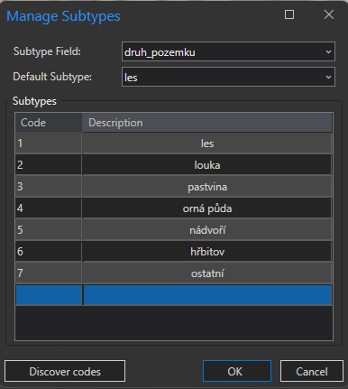
    <figcaption>Přiřazení kódu subtypům</figcaption>
</figure>

???+ note "&nbsp;Rozlišení subtypů v symbologii:"
      Pro přehlednější práci s daty, je vhodné rozlišit typy ploch barevně. To lze provést přes kliknutí pravým tlačítkem na vrstvu v *:material-tab: Contents*{: .outlined_code} → *:material-form-dropdown: Symbology*{: .outlined_code} → změnit *:material-button-cursor: Single Symbol*{: .outlined_code} na *:material-button-cursor: Unique Values*{: .outlined_code} → změnit atribut v nabídce *:material-form-dropdown: Field 1*{: .outlined_code} na požadovaný (např. *druh_pozemku*).

#### Kresba

Následuje samotný proces vektorizace, tedy "obkeslení" rastrových dat a vytvoření nových dat ve vektorové formě.

**1.** Nástroje editace vektorových dat se nacházejí v záložce *:material-tab: Edit*{: .outlined_code} v horní části programu. 

**2.** Nové prvky vytvoříme tlačítkem *:material-button-cursor: Create*{: .outlined_code} → zvolení kresby daného subtypu v okně *:material-tab: Create Features*{: .outlined_code}.

**3.** Vektorizované body přidáváme levým tlačítkem myši. Pro dokončení vektorizace určitého prvku buď dvakrát klikneme levým tlačítkem myši nebo zvolíme ikonu *:material-button-cursor: Finish*{: .outlined_code} v nástrojích v dolní části obrazovky. Při vektorizaci je potřeba myslet na nastavení přichycování bodů [_:material-button-cursor: Snapping_{: .outlined_code}](https://pro.arcgis.com/en/pro-app/latest/help/editing/enable-snapping.htm).

<figure markdown>
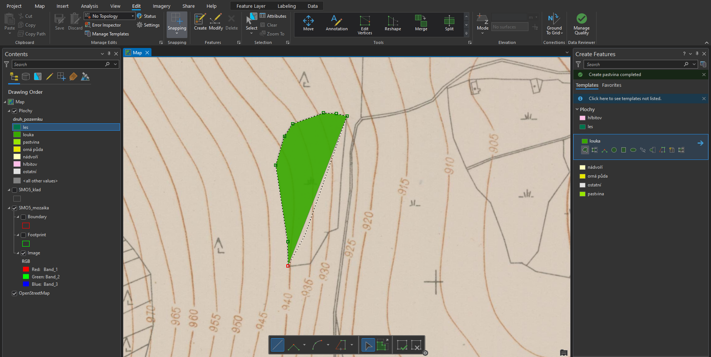
    <figcaption>Vektorizace rastrové mapy</figcaption>
</figure>

**Popis nejčastěji používaných funkcí a klávesových zkratek pro editaci vektorových dat:**

<table style="width: 100%;">
  <tbody>
    <tr>
      <td markdown><strong>Right Angle Line</strong></td>
      <td>pravoúhlá linie</td>
    </tr>
    <tr>
      <td><strong>Direction Direction</strong></td>
      <td>průsečík dvou linií</td>
    </tr>
    <tr>
      <td><strong>Arc Segment</strong></td>
      <td>oblouk</td>
    </tr>
        <tr>
      <td><strong>Trace</strong></td>
      <td>přichycení na jiný vektorový prvek v mapě</td>
    </tr>
        <tr>
      <td><strong>stisknutí D</strong></td>
      <td>určení délky linie</td>
    </tr>
        <tr>
      <td><strong>stisknutí A</strong></td>
      <td>určení úhlu linie</td>
    </tr>
        <tr>
      <td><strong>stisknutí P</strong></td>
      <td>rovnoběžná kresba s linií určenou kurzorem myši</td>
    </tr>
        <tr>
      <td><strong>držení T</strong></td>
      <td>zobrazení lomových bodů v okolí kurzoru</td>
    </tr>
        <tr>
      <td><strong>stisknutí F2</strong></td>
      <td>dokončení kresby</td>
    </tr>
        <tr>
      <td><strong>stisknutí F3</strong></td>
      <td>dokončení kresby v pravém úhlu</td>
    </tr>
        <tr>
      <td><strong>stisknutí pravého tlačítka myši</strong></td>
      <td>zobrazení dalších možností kresby</td>
    </tr>
  </tbody>
</table>

???+ note "&nbsp;Uložení editace:"
      Po provedení změn v editaci vektorových dat, je nutné je uložit tlačítkem *:material-button-cursor: Save*{: .outlined_code} v záložce *:material-tab: Edit*{: .outlined_code}.

### Kontrola topologie vektorových dat

Jestliže chceme zkontrolovat topologickou čistotu vektorových dat, musejí být veškerá kontrolovaná data uložena uvnitř jednoho datasetu.

**1.** Pro vytvoření nové topologie klikneme pravým tlačítkem myši na dataset → *:material-form-dropdown: New*{: .outlined_code} → *:material-form-dropdown: Topology*{: .outlined_code}.

**2.** Na první stránce otevřeného okna *:material-tab: Create Topology Wizard*{: .outlined_code} se definují parametry topologie, tedy její název, přesnost a vstupní vrstvy.

**3.** Druhá stránka obsahuje definice jednotlivých kontrolovaných topologických pravidel. Ta se nastaví dle potřeby. V této ukázce proběhne kontrola pravidel *:material-magnify: Must Not Have Gaps (Area)*{: .outlined_code} (data nesmí obsahovat mezery), *:material-magnify: Must Not Overlap With (Area-Area)*{: .outlined_code} (vrstvy se vzájemně nesmějí překrývat) a *:material-magnify: Must Not Overlap (Area)*{: .outlined_code} (jednotlivé vrstvy sami sebe nesmějí překrývat).

[:material-vector-polygon-variant: Přehled pravidel pro kontrolu topologie](https://pro.arcgis.com/en/pro-app/latest/help/editing/geodatabase-topology-rules-for-polygon-features.htm){ .md-button .md-button--primary }
{: .button_array}

**4.** Třetí stránka obsahuje souhrn celé topologie. Tlačítkem *:material-button-cursor: Finish*{: .outlined_code} spustíme kontrolu.

**5.** Pokud se ve výstupním datasetu topologie nezobrazí, aktualizujeme jeho obsah kliknutím pravého tlačítka myši → *:material-form-dropdown: Refresh*{: .outlined_code}.

<figure markdown>
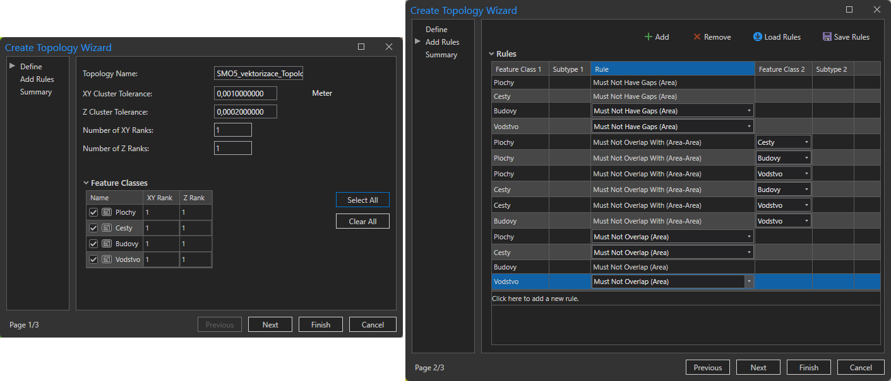
    <figcaption>Nastavení topologie</figcaption>
</figure>

**6.** V následujícím kroku je potřeba kontrolu topologie validovat kliknutím pravým tlačítkem na topologii v *:material-tab: Catalogu*{: .outlined_code} → *:material-button-cursor: Validate*{: .outlined_code}.

**7.** Po validování přesuneme vrstvu topologie do mapového okna a měly bychom vidět objevené chyby.

**8.** Pomocí nástrojů *:material-button-cursor: Edit*{: .outlined_code} opravíme vyznačené chyby v původních datech. Po editaci topologii znovu validujeme a jestliže kontrola topologie neobjeví žádné chyby, znamená to, že kontrolované vrstvy jsou topologicky korektní.

Na obrázku níže je zobrazena ukázka dvou nalezených topologických chyb (levý horní snímek). Pravý horní snímek zobrazuje pohled na data bez opravy topologie. Při porovnání s pravým dolním snímkem je zřejmé, že vektorizace cesty chybně překryla vektorizaci pastviny. Snímek vlevo dole zobrazuje druhou chybu, tedy vzájemný překryv dvou prvků patřících do vrstvy *:simple-databricks: Cesty*{: .outlined_code}.

<figure markdown>
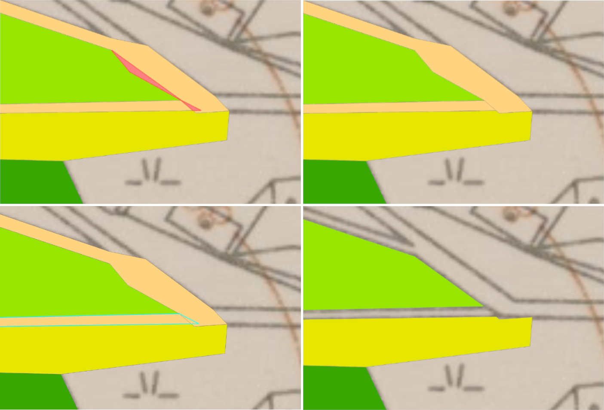
    <figcaption>Ukázka topologických chyb</figcaption>
</figure>

???+ note "&nbsp;Tipy po urychlení kontroly topologie:"
      - Pokud je to možné, lze u dat se stejným atributem (např. les, louka) provést [*:material-cog: __Dissolve__*{: .outlined_code}](https://pro.arcgis.com/en/pro-app/latest/tool-reference/data-management/dissolve.htm), kterým ze sloučených dat odstraníme případné chyby z překryvu stejnou vrstvou (třeba dvě louky vzájemně se překrývající).
      - Pro zjednodušení kontroly topologie je možné všechna kontrolovaná data sloučit do jedné vrstvy, kterou následně zkontrolujeme samotnou. Nemusíme tedy řešit překryvy jednotlivých vrstev mezi sebou *:material-magnify: Must Not Overlap With*{: .outlined_code}, ale zkontrolujeme pouze novou vrstvu samostatně vůči sobě *:material-magnify: Must Not Overlap*{: .outlined_code}. Důležité je však po kontrole nezapomenou opravit případné chyby v původních datech.
    
      [:material-vector-polygon-variant: Schématicky popsaná pravidla kontroly topologie](https://pro.arcgis.com/en/pro-app/latest/help/editing/pdf/topology_rules_poster.pdf){ .md-button .md-button--primary }
      {: .button_array}

???+ note "&nbsp;Zajímavé odkazy"
      - Draw Detailed Polygons in ArcGIS Pro, Fast and Easy: [https://youtu.be/Ab9aqsHj8X8?si=C4CCfrIkuYrrwDoK](https://youtu.be/Ab9aqsHj8X8?si=C4CCfrIkuYrrwDoK)
      - Copy features between layers: [https://learn.arcgis.com/en/projects/copy-features-between-layers/](https://learn.arcgis.com/en/projects/copy-features-between-layers/)

## Úlohy k procvičení

!!! task-fg-color "Úlohy"

    K řešení následujích úloh použijte datovou sadu [ArcČR
    500](../../data/#arccr-500) verzi 3.3 dostupnou na disku *S* ve složče
    ``K155\Public\data\GIS\ArcCR500 3.3``. Zde také najdete souboru s
    popisem dat ve formátu PDF. 

    1. Zjistěte, jaká je délka silnic I. třídy, II. třídy a III. třídy na
       mapovém listu ZM10 02-34-14

           Postup:

           - vytvořte datový model pro silniční síť ČR (včetně domén, příp. subtypů)
           - nastavte topologická pravidla pro příslušný dataset (silnice se nesmí křížit, nesmí mít volné konce,...)
           - připojte si pomocí služby ArcGIS Online (Add Data ► From ArcGIS Online) data ZM10 (datová vrstva *Základní mapy ČR (S-JTSK)*) 
           - zvektorizujte území zájmového mapového listu 
           - exportujte vektorizovaná data do souřadnicového systému S-JTSK (Krovak East North)
           - určete délku jednotlivých typů silnic na mapovém listu

    2. Zjistěte délku a průběh nejkratší silniční spojnice z křižovatky na
       východ od osady Kocourov do ústřední křižovatky (350 m n. m.) ve
       vsi Sutom. Zjistěte úhrnnou plochu lesů.

           K vypracování úlohy využijte dvojice rastrů Státní mapy odvozené
           (SMO-5) – původního vydání z počátku 50. let 20. století. Rastry
           Litoměřice 7–5 a 7–6 jsou k dispozici
           [zde](http://rytiny.fsv.cvut.cz/155GIS1/). Na stejném místě najdete
           také klad Státní mapy 1 : 5000 v podobě Shapefile. Vyzkoušejte si
           možnosti vizuální úpravy světlosti a barevnosti rastrů pomocí Image
           analysis.

           Postup:

           - využijte dříve vytvořený datový model pro silniční síť ČR – v GDB založte novou třídu prvků
           - stáhněte si klad listů Státní mapy 1 : 5000 a oba mapové listy (pracujte v systému S-JTSK)
           - georeferencujte oba listy projektivní transformací na dodaný klad
           - vytvořte bezešvý kus kresby SMO-5 formou mozaiky s mapovými listy oříznutými kladem na pouhé mapové pole
           - zvektorizujte předmětné silnice mezi Kocourovem a Sutomí  
           - odečtěte vzdálenost různými cestami, změřte a vyberte nejkratší
           - založte třídu prvků pro lesy a zvektorizujte plochy lesů (neuvažujte lesopark ve Vlastislavi)
           - zachovejte si data z dnešní hodiny – během cvičení na téma WFS si porovnáte vámi zvektorizované části silniční sítě a lesních ploch s daty ze ZABAGED

           Pozn.: mapové listy SMO-5 jsou graficky upraveny, aby byl patrnější
           obsah. Původně byly mapové listy zažloutlé a s nevýraznou
           kresbou. Jedná se o vůbec první vydání tohoto mapového díla. V
           současnosti se používá označení SM-5 (Státní mapa 1 : 5000) a vypadá
           vizuálně poněkud jinak, přestože základní obsah je shodný a znakový
           klíč doznal jen drobnějších změn.

    3. Zjistěte délku katastrální hranice mezi k. ú. Pnětluky a
       k. ú. Vlastislav.

           K vypracování úlohy využijte rastr PCO tehdejšího katastráního území
           *Netluk* (dnes Pnětluky u Podsedic; část obce Podsedice) z
           roku 1843. Rastr je k dispozici ve stejné
           [složce](http://rytiny.fsv.cvut.cz/155GIS1/) jako předchozí
           data. Vyzkoušejte si obecně nerovnoběžníkový tvar ořezu rastru v
           mozaice.
