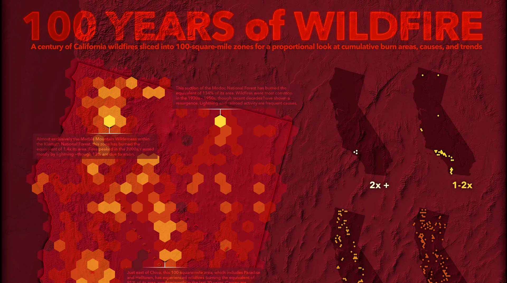
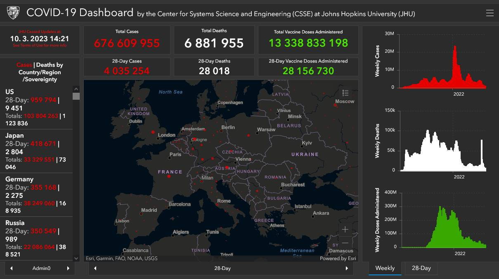
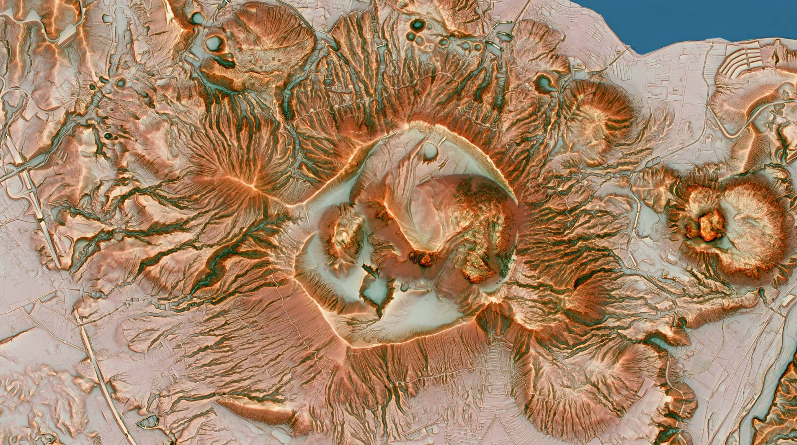
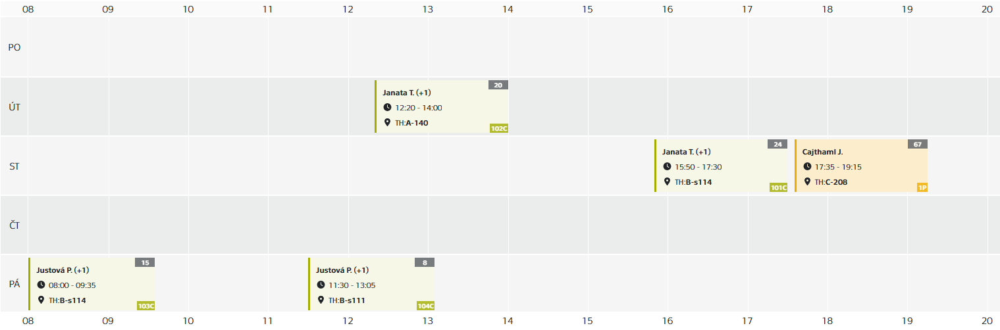

# GIS {: .page_title}

Předmět vás seznámí se základy tzv. __geografických informačních systémů__ (GIS). GIS je soubor nástrojů sloužících ke __sběru__, __správě__, __analýze__ a __vizualizaci__ geografických dat. Umožňuje efektivně pracovat s prostorovými informacemi, což zahrnuje __mapy__, __satelitní snímky__, __adresy__, __topografické údaje__ a mnoho dalšího. Dokáže provádět složité analýzy, identifikovat vzory, a tím __lépe porozumět geografickým jevům a vztahům__.

GIS má široké uplatnění, od __městského plánování__, přes __správu přírodních zdrojů__ až po __krizový management__. Je nepostradatelným nástrojem pro efektivní rozhodování a řízení v různých odvětvích a pomáhá lépe pochopit složité geografické souvislosti.

Zatímco přednášky vás provedou základní teorií, cvičení se věnují praktickému ovládání GIS software – zejména porozumění práce s daty a provádění základních analýz. Během výuky je používán software __:simple-arcgis: Esri ArcGIS Pro__{: style="white-space: nowrap;"}.

<h2 style="text-align:center;">Naučíte se</h2>
<!-- styl je zde pridany HTML tagem (ne pomoci '##'), aby se text neobjevil v tabulce obsahu vlevo na strance -->

 <!-- specificky format gridu (trida "grid_icon_info") na miru uvodni strance predmetu -->

-   :material-map-outline:{ .xl }

    __zpracovávat__ a __analyzovat__ prostorová (tj. geografická, mapová) data

-   :material-vector-polygon:{ .xl }

    porozumět rozdílu mezi __vektorovými__ a __rastrovými__ daty

-   :material-filter-outline:{ .xl }

    __filtrovat__ data pomocí atributových a prostorových dotazů

-   :material-tools:{ .xl }

    aplikovat základní __prostorové funkce__ (nástroje geoprocessingu)

-   :material-creation-outline:{ .xl }

    __tvořit__ a __editovat__ GIS data

-   :octicons-share-16:{ .xl }

    __sdílet__ data prostřednictvím webu (systém _ArcGIS Online_, webové mapové aplikace)

{: .no-filter }
{: .no-filter }
{: .no-filter }
{: .no-filter }
{: .no-filter }
{: .no-filter }
{: .no-filter }
{: .no-filter }
{: .no-filter }
{: .no-filter }
{: .no-filter }
{: .no-filter }

<!-- ## Doporučená literatura

1. Kolář, J.: Geografické informační systémy 10. Vydavatelství ČVUT, Praha 1998.
2. Rapant, P. (2006): Geoinformatika a geoinformační technologie. VŠB-TU Ostrava, 500 str. ISBN 80-248-1264-9.
3. Břehovský, M., Jedlička, K. (2005): Přednáškové texty pro Úvod do GIS. ZČU Plzeň, 116 s.
4. Hrubý M.: Geografické Informační Systémy (GIS) - Studijní opora. VÚT v Brně, 91 str.
5. Tuček J.: Geografické informační systémy, Praha Computer Press, 1998. -->

## Přednášky {: style="margin-bottom:0;"}

účast doporučená
{: style="opacity:50%;margin-top:0;"}

{.off-glb .no-filter style="height: 1.5em; vertical-align: -.4em; clip-path: circle();"} [**__prof. Ing. Jiří Cajthaml, Ph.D.__**](https://geomatics.fsv.cvut.cz/employees/jiri-cajthaml/)

1. Definice GIS, informatika, základní pojmy, aplikační oblasti GIS, prostor, topologie, historie GIS

2. Reálný svět × GIS, model v GIS, vztahy objektů, typy modelů, geometrické typy objektů, rozlišovací schopnost

3. Geografická poloha v GIS, prostorové vztahy, atributy

4. Čas v GIS, modelování, druhy modelů, chyby v modelování v GIS

5. Vektorový a rastrový GIS, datová struktura

6. Rastrový GIS, atributová data

7. Vektorový GIS, druhy objektů

8. Geometrické a topologické vlastnosti objektů ve vektorovém GIS

9. Vektorová a rastrová reprezentace prostorových objektů

10. Rastrová reprezentace prostorových objektů, způsob ukládání rastrových objektů

## Cvičení {: style="margin-bottom:0;"}

účast doporučená
{: style="opacity:50%;margin-top:0;"}

{.off-glb .no-filter style="height: 1.5em; vertical-align: -.4em; clip-path: circle();"} [**__Ing. Tomáš Janata, Ph.D.__**](https://geomatics.fsv.cvut.cz/employees/tomas-janata/)__&nbsp;__{style="margin-left:1rem;"}{.off-glb .no-filter style="height: 1.5em; vertical-align: -.4em; clip-path: circle();"} [**__Mgr. Petra Justová, Ph.D.__**](https://geomatics.fsv.cvut.cz/employees/petra-justova/)__&nbsp;__{style="margin-left:1rem;"}{.off-glb .no-filter style="height: 1.5em; vertical-align: -.4em; clip-path: circle();"} **__Ing. Tereza Černohousová__** __&nbsp;__{style="margin-left:1rem;"}{.off-glb .no-filter style="height: 1.5em; vertical-align: -.4em; clip-path: circle();"} **__Ing. Filip Roučka__**

| **cv.** | **C101** | **C102** | **C103** | **C104** | **téma** | **odevzdání / test** |
| :---: | :---: | :---: | :---: | :---: | --- | --- |
|  |  |  | 25.9. – odpadá | 25.9. – odpadá |  |  | 
| 1 | 23.9. | 22.9. | 2.10. | 2.10. | Úvod do práce v prostředí ArcGIS, prostorová data, datové zdroje, atributová tabulka | |
| 2 | 30.9. | 29.9. | 9.10. | 9.10. | Vektorová data, atributové dotazy, prostorové dotazy, souřadnicové systémy | |
| 3 | 7.10. | 6.10. | 16.10. | 16.10. | Prostorové funkce (geoprocessing), spatial join | |
| 4 | 14.10. | 13.10. | 23.10. | 23.10. | Práce s externími daty (Excel, CSV), join | 13.–16.10. průběžný test (30 min) |
| 5 | 21.10. | 20.10. | 30.10. | 30.10.| Rastrová data, tvorba digitálního modelu terénu | |
|  | 28.10. – odpadá |  |  |  |  |  |
| 6 | 4.11. | 27.10. | 6.11. | 6.11.  | Georeferencování, vektorizace, kontrola topologie, editační funkce (část 1) | 1.11. gdb + technická zpráva |
| 7 | 11.11. | 3.11. | 13.11. | 13.11. | Georeferencování, vektorizace, kontrola topologie, editační funkce (část 2), tvorba layoutu | |
| 8 | 18.11. | 10.11. | 20.11. | 20.11. | Topografická analýza povrchu, reklasifikace rastrových dat, mapová algebra 1 | |
|  |  | 17.11.– odpadá |  |  |  |  |
| 9 | 25.11. | 24.11. | 27.11. | 27.11. | ArcGIS Online, tvorba webových mapových aplikací | |
| 10 | 2.12. | 1.12. | 4.12. | 4.12. | Viditelnost, interpolace, mapová algebra 2 | |
| 11 | 9.12. | 8.12. | 11.12. | 11.12. | Hydrologické analýzy, ModelBuilder | |
| 12 | 16.12. | 15.12. | 18.12. | 18.12. | Prezentace projektů | 15.–18.12. webová mapová aplikace |

### **Podmínky zápočtu**

- získání min. 60 % bodů v průběžném testu (4. týden semestru) 
- odevzdání a prezentace [semestrální práce](#semestralka) ve stanovených termínech (tematická geodatabáze + technická zpráva + webová mapová aplikace)

## **Doporučené zdroje**
### **Literatura**

1. Kolář, J. (1998): Geografické informační systémy 10. Vydavatelství ČVUT, Praha.
2. Rapant, P. (2006): Geoinformatika a geoinformační technologie. VŠB-TU Ostrava, 500 str. ISBN 80-248-1264-9.
3. Břehovský, M., Jedlička, K. (2005): Přednáškové texty pro Úvod do GIS. ZČU Plzeň, 116 s.
4. Hrubý M.: Geografické Informační Systémy (GIS) - Studijní opora. VÚT v Brně, 91 str.
5. Tuček J. (1998): Geografické informační systémy, Praha Computer Press, 1998.
6. Geletič, J., Hladiš, L., Šimáček, P. (2019): [GIS pro geografy. Distanční studijní opora](https://geography.upol.cz/soubory/studium/opory/D_GIS.pdf). Univerzita Palackého v Olomouci, 141 s.

### **Tutoriály**

1. Webové stránky předmětu [GIS1](https://k155cvut.github.io/gis-1/)
2. Webové stránky předmětu [GIS2](https://k155cvut.github.io/gis-2/)
3. [Learn ArcGIS Hub](https://learn.arcgis.com/en/gallery/#?p=arcgispro)
4. [Esri Training Catalog](https://www.esri.com/en-us/training/catalog/all-training)
5. [MOOCs and Live Training Seminars](https://www.esri.com/en-us/training/catalog/live-training-seminars-moocs)
6. [Urban Planning, Design & Development Software](https://www.esri.com/en-us/arcgis/products/arcgis-urban/overview)

---

## Rozvrh {: style="margin-bottom:0;"}

zimní semestr 2026/2027
{: style="opacity:50%;margin-top:0;"}

{.off-glb .no-filter}

[Stránka předmětu v :custom-kos-logo-img-BW:{.middle style="margin-left:3px;"} :custom-kos-logo-BW:{.xl .middle}](https://kos.cvut.cz/course-syllabus/155GISZ/B261){ .md-button .md-button--primary target="_blank"}
{align=center}

 

<!-- ## Přednášky {: style="margin-bottom:0;"}

účast doporučená
{: style="opacity:50%;margin-top:0;"}

{: .off-glb .no-filter style="height: 1.5em; vertical-align: -.4em; clip-path: circle();"} 
[__prof. Ing. Lena Halounová, CSc.__](https://geomatics.fsv.cvut.cz/employees/lena-halounova/)

1. Definice GIS, informatika, základní pojmy, aplikační oblasti GIS, prostor, topologie, historie GIS
2. Reálný svět × GIS, model v GIS, vztahy objektů, typy modelů, geometrické typy objektů, rozlišovací schopnost
3. Geografická poloha v GIS, prostorové vztahy, atributy
4. Čas v GIS, modelování, druhy modelů, chyby v modelování v GIS
5. Vektorový a rastrový GIS, datová struktura
6. Rastrový GIS, atributová data
7. Vektorový GIS, druhy objektů
8. Geometrické a topologické vlastnosti objektů ve vektorovém GIS
9. Vektorová a rastrová reprezentace prostorových objektů
10. Rastrová reprezentace prostorových objektů, způsob ukládání rastrových objektů

## Harmonogram {: style="margin-bottom:0;"}
semestr LETNÍ 2024/2025
{: style="opacity:50%;margin-top:0;"}

[{.off-glb .no-filter}](https://kos.cvut.cz/schedule/course/1551GIS/semester/B232){target="_blank"}
[{.off-glb .no-filter}](https://kos.cvut.cz/schedule/course/1551GIS/semester/B232){target="_blank"}

---

[Stránka předmětu v :custom-kos-logo-img-BW:{.middle style="margin-left:3px;"} :custom-kos-logo-BW:{.xl .middle}](https://kos.cvut.cz/course-syllabus/1551GIS/B232){ .md-button .md-button--primary target="_blank"}
{align=center}

 
-->