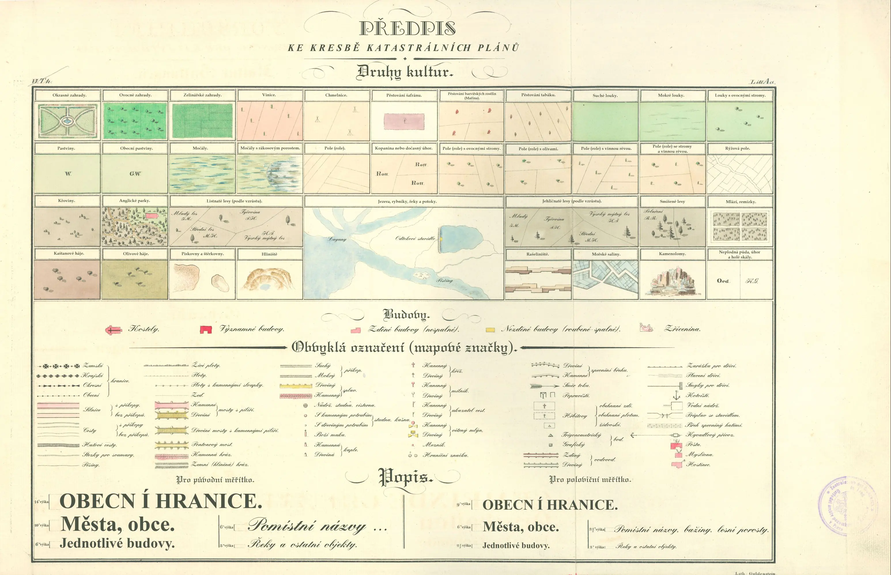
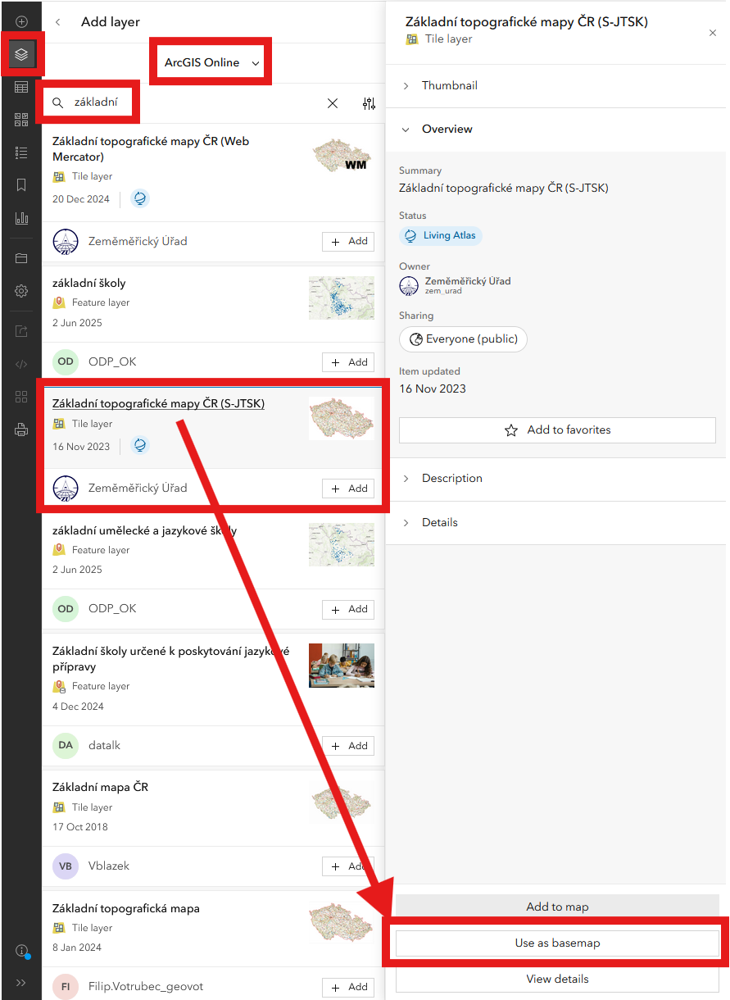

# Semestrální práce - Analýza území {: .page_title}

## Zadání
Nad zadaným územím proveďte následující analýzy s využitím GIS softwaru. Výsledky jednotlivých úloh následně publikujte formou webové mapové aplikace na ArcGIS Online či pomocí open-source řešení (např. GISQuick). Doporučená forma webové mapové aplikace je ArcGIS Story Maps. 

Svou aplikaci na konci semestru krátce odprezentujete před ostatními v 5minutové prezentaci. 

Dotazy či připomínky k semestrální práci směřujte sem: *frantisek.muzik@fsv.cvut.cz*{.outlined}

<div class="grid cards" markdown>

-   :simple-maildotru: __Konkrétní zadání__ 
    
    ---

    Viz [sdílená tabulka](https://docs.google.com/spreadsheets/d/1Wcg4uOLRML0dFriV6YLUgqA0S5ZwTsz4pdNuKFSULMw/edit?usp=sharing).

-   :material-presentation-play: __Termín prezentace__
    
    ---

    __6.5.2026__ proběhne __5minutová__ prezentace výsledné webové mapové aplikace.
</div>

<hr class="level-1">

**Pro zadané území vypracujte následující úkoly:**

### 1. Identifikace obce a katastrálních území

- Zjistěte do jaké obce spadá zadané katastrální území. 

- Vyberte odpovídající obec z [Registru územní identifikace, adres a nemovitostí (RÚIAN)](https://k155cvut.github.io/gis-1/data/#ruian) a exportujte ji jako samostatnou vrstvu (zdroj: _:material-layers-triple: RÚIAN_{.bg}, _:material-layers: Obec_{.bg}).

- Dále zjistěte veškerá katastrální území nacházející se na území vaší obce a vyexportujte je do samostatné vrstvy (zdroj: _:material-layers-triple: RÚIAN_{.bg}, _:material-layers: KatastralniUzemi_{.bg}). 

!!! warning "Rozlišení katastrálního území vs. území obce"

    V následujících úkolech je důležité rozlišovat zadané katastrální území a obec, pod kterou toto území spadá. V některých úlohách se pracuje s celou obcí, v jiných pouze se zadaným katastrem.

    Jedna obec se může skládat z jednoho či více katastrálních území. Názvy katastrálních území jsou jednoznačné, kdežto obce mohou mít duplicitní názvy napříč republikou.


---

### 2. Adresní místa a stavební objekty

- Určete počet adresních míst na území dané obce (zdroj: _:material-layers-triple: RÚIAN_{.bg}, _:material-layers: AdresniMisto_{.bg}). Adresní místa zobrazte v mapě.

- Vyberte stavební objekty v obci (zdroj: _:material-layers-triple: RÚIAN_{.bg}, _:material-layers: StavebniObjekt_{.bg}). Tyto objekty vhodným nastavením stylu vrstvy vizualizujte dle atributu _:material-table: Připojení na kanalizační síť_{.bg}.


|KÓD| Připojení na kanalizační síť               |
|---|----------------------|
| 1 |Přípoj na kanalizační síť   |
| 2 |Vlastní ČOV |
| 3 |Žumpa, jímka, septik             |
| 4 |Bez kanalizace a jímky           |
| 8 |Nedefinováno          |
| 9 |Nezjištěno            |


- Jednotlivým kategoriím nastavte barevnou výplň dle následujících kartografických zásad:
    - kategoriím typu `nedefinováno`, `nezjištěno`, `null`, `žádná hodnota` nastavte __šedou barvu__{style="color:grey;"}
    - ostatní __kategorie barevně rozlište dle stupně naplnění jevu__:
        - kategorii typu `Přípoj na kanalizační síť` odpovídajícím naplnění jevu nastavte __zelenou barvu__{style="color:green;"}
        - kategoriím typu `Vlastní ČOV` či `Žumpa, jímka, septik` na pomezí naplnění/nenaplnění jevu nastavte neutrální __žlutou__{style="color:#f2d14e;"}/__oranžovou barvu__{style="color:orange;"}
        - kategoriím typu `bez kanalizace` odpovídajícím nenaplnění jevu nastavte __červenou barvu__{style="color:red;"}


---

### 3. Chráněná území v okolí

- Najděte nejbližší maloplošné zvláště chráněné území (zdroj: _:material-layers-triple: [ZABAGED](https://ags.cuzk.gov.cz/arcgis/rest/services/ZABAGED_POLOHOPIS/MapServer)_{.bg}, _:material-layers: Maloplošné zvlástě chráněné území_{.bg}). 

- Zobrazte jej v mapě jako samostatnou vrstvu. Zobrazte názvy vybraných území (záložka Labeling -> Field: NAZEV)

---

### 4. Vytvoření vrstvy využití pozemků

- Vytvořte samostatnou vrstvu, která bude obsahovat data způsobu využití pozemku **v celém zadaném KATASTRÁLNÍM ÚZEMÍ** (zdroj: _:material-layers-triple: RÚIAN_{.bg}, _:material-layers: Parcela_{.bg}). Pro urychlení výpočtu nejprve vyberte parcely na základě atributu _:material-table: Nadřazené katastrální území_{.bg}.

- Dle atributů v tabulce níže vypočítejte pro data nový sloupec _:material-table: TYP_VYUZITI_{.bg}, na základě kterého vrstvu následně vhodně vizualizujte. Číselníky pro přiřazení kódů: [Způsob využití pozemku](https://www.cuzk.cz/Katastr-nemovitosti/Poskytovani-udaju-z-KN/Ciselniky-ISKN/Ciselniky-k-nemovitosti/Zpusob-vyuziti-pozemku.aspx), [Kód druhu pozemku](https://www.cuzk.cz/Katastr-nemovitosti/Poskytovani-udaju-z-KN/Ciselniky-ISKN/Ciselniky-k-nemovitosti/Druh-pozemku.aspx). Závěrem proveďte *Dissolve* dle atributu _:material-table: TYP_VYUZITI_{.bg}.

!!! note "&nbsp;<span style="color:#448aff">Nápověda</span>"
      Data se vhodně protřídí dle kódů níže pomocí funkce *Select by attributes* (využití spojky AND pro určení kódů z obou sloupců *SC_D_POZEMKU* a *SC_ZP_VYUZITI_POZ* najednou). Takto vybraným plochám se následně přiřadí nový atribut. 
      
      Například pro určení orné půdy vybereme *SC_D_POZEMKU* = 2. Pro určení zastavěné plochy už budeme muset využít oba sloupce s kódy pozemků, a tedy musíme vybrat *SC_D_POZEMKU* = 13 a *SC_ZP_VYUZITI_POZ*  *is Null*

      V případě určování typu využití pozemku (sloupec *TYP_VYUZITI*) pro atributy *ostatní* a *komunikace* musí platit výběr prvků ze sloupců *Kód druhu pozemku* a *Způsob využití pozemku* zároveň (tedy využití *AND* ve funkci *Select by attributes*).


|  Typ využití pozemku *TYP_VYUZITI* (vypočtené)       | Kód druhu pozemku *SC_D_POZEMKU*        | Způsob využití pozemku *SC_ZP_VYUZITI_POZ*            
| ------------ | ------------------------- |----------------|
| orná půda    | 2 | -|
| lesní půda | 10 |  -|
| trvalý travní porost   | 7, 8 | -|
| zahrada    | 5, 6 | -|
| vodstvo   | 11 | -|
| zastavěná plocha     |  13  | *Null* |
| nádvoří     |  13  | *Not Null* |
| komunikace   | 3, 4 , 14 | 14, 15, 16, 17|
| ostatní   | 3, 4 , 14 | vše kromě 14, 15, 16, 17|

---

### 5. Georeferencování císařských otisků

- Pro zadané katastrální území georeferencujte rastry Císařských otisků stabilního katastru (CO) z poloviny 19. století. Najdete je na sdíleném disku ```S:\K155\Public\data\GIS\SP2026_CO```. Vaše zadání si překopírujte na disk svého počítače.

- Pro georeferencování využívejte identické body (rohy budov, boží muka), polygony současných parcel či hranice katastrálních území (ta se však mohou lišit oproti stavu v 19. století). 

- Z georeferencovaných rastrů vytvořte mozaiku. Rastrovou mapu Císařských otisků stabilního katastru **neexportujte** do výsledné webové aplikace.

---

### 6. Vektorizace využití ploch CO
- Na podkladu CO vektorizujte **celé zadané katastrální území**. V případě změny v hranicích katastrálního území vektorizujte pouze prvky spadající do současného vymezení katastru dle  _:material-layers-triple: RÚIAN_{.bg}, _:material-layers: KatastralniUzemi_{.bg}. Tato data následně slučte na základě typů využití ploch (funkce *Dissolve*).  Není tedy nutné samostatně vektorizovat každou parcelu zvlášť, tudíž ideálně provádějte vektorizaci v rámci více sousedících parcel stejného využití.

- Rozlišujte následující typy využití ploch (stejně jako v bodě 5 pro data z RÚIAN): 

    - orná půda

    - lesní půda

    - trvalý travní porosty (louky, pastviny)

    - zahrada

    - vodstvo (řeky, potoky, rybníky), nevektorizujte malé vodní toky vyznačené pouze liniově

    - zastavěná plocha

    - nádvoří (okolí domů, neoznačené zahrady, veřejné prostory v intravilánu)

    - komunikace (cesty, silnice, železnice)

    - ostatní lomy, neúrodná půda apod.

<figure markdown>
{ width="1000" }
    <figcaption>Značkový klíč Císařských otisků stabilního katastru</figcaption>
</figure>

---

### 7. Kontrola topologie vektorizace
- Proveďte topologickou kontrolu vektorizovaných dat CO podle pravidel:

    - Must Not Have Gaps (Area) – nesmí být mezery mezi plochami.

    - Must Not Overlap With (Area-Area) – plochy se nesmí překrývat.

    - Must Not Overlap (Area) – jednotlivé třídy využití se nesmí překrývat.

---

### 8. Porovnání vývoje využití krajiny (19. století a současnost)

- Ve webové aplikaci porovnejte vývoj využití krajiny v polovině 19. století (vektorizace z CO) se současností (_:material-layers-triple: RÚIAN_{.bg}, _:material-layers: Parcela_{.bg}). Způsob porovnání zvolte dle vlastního uvážení (posuvník v aplikaci, nová vrstva s vypočtenými rozdíly apod.).

---

### 9. Přidání online mapové služby (WMS, WMTS, WFS)

- Přidejte jednu online mapovou službu dle vlastního výběru (např. historická mapa, ortofoto, katastrální mapa).

- Tato vrstva musí být součástí výsledné mapové aplikace.

---

### 10. Analýza nejvyššího a nejnižšího bodu obce

- Pomocí digitálního modelu reliéfu 5. generace (DMR5G) zjistěte body s nejnižší a nejvyšší nadmořskou výškou na území obce. Zjištěné hodnoty uveďte ve webové aplikaci.

---

### 11. Tvorba webové mapové aplikace

- Vytvořte webovou mapovou aplikaci a vyexportujte do ní požadované vrstvy.

- Na začátek storymapy přidejte obecné informace o obci, např. popis lokality, vývoj počtu obyvatel či zajímavost/památka.

- Pro všechny mapy ve webové aplikaci použijte podkladovou mapu s názvem **Základní topografické mapy ČR (S-JTSK)**, která je k dispozici na ArcGIS Online od uživatele *Zeměměřický úřad*. Nastavením podkladové mapy v systému S-JTSK se eliminuje posun některých připojených vrstev (např. Stavebních objektů). Podkladové mapě lze nastavit průhlednost pro lepší čitelnost ostatních mapových vrstev.

<figure markdown>
{ width="600" }
    <figcaption>Změna podkladové mapy v ArcGIS Online</figcaption>
</figure>

- Mapová aplikace včetně využitých vrstev musí mít nastavené veřejné sdílení v ArcGIS Online. Název mapové aplikace musí být ve formátu __Prijmeni_Jmeno_GIS1_2026_SP__{.outlined} (tedy například Muzik_Frantisek_GIS1_2026_SP).

- Součástí webové aplikace musí být seznam použitých datových zdrojů.

---

[Ukázková aplikace](https://arcg.is/1SenW80){ .md-button .md-button--primary }
{: .button_array}
